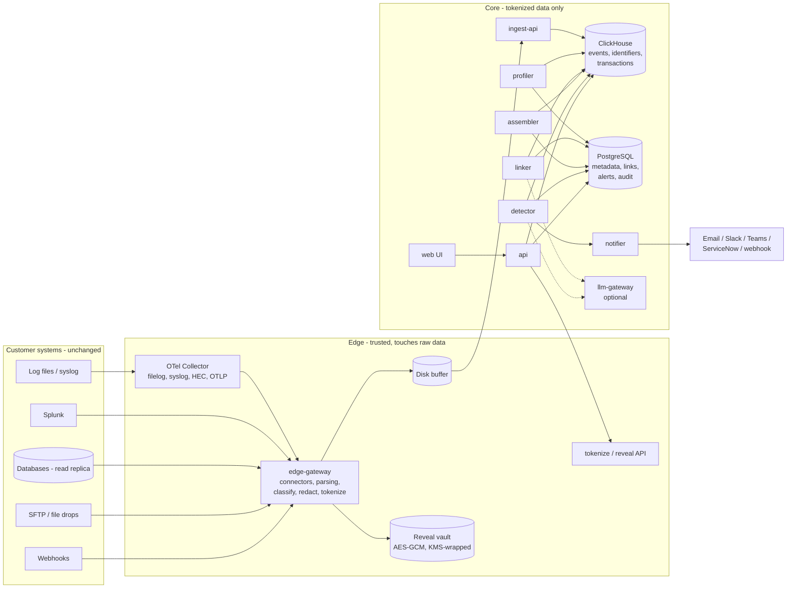

# Carto v1 Build Spec

**Codename:** `carto` (short for cartographer; use it for repo, package and service names until the product is named)
**Status:** v1 build spec, source of truth for implementation
**Owner:** Pradhi Pakkerakari
**Last updated:** 2026-10-06

---

## 0. How to use this document

This spec is written for Claude (or any engineer) building v1 from an empty repository. Put it at `docs/SPEC.md` and reference it from `CLAUDE.md` (a starter `CLAUDE.md` is in Appendix D).

### 0.1 Working agreement for the building agent

1. **Read the whole spec before writing code.** Sections reference each other.
2. **Section 2.3 (Non-negotiables) is a hard constraint.** If a task seems to require breaking one, stop and ask the founder. Do not work around it.
3. **Build milestone by milestone (Section 21).** Do not start milestone N+1 until milestone N's acceptance criteria pass in CI.
4. **For each milestone:** write a short plan in `docs/plans/M<n>.md`, then tests, then code. Keep pull requests small and focused.
5. **Record every decision that deviates from or extends this spec** as an ADR in `docs/adr/NNNN-title.md` (context, decision, alternatives, consequences).
6. **Treat every external input as untrusted:** log lines, files, connector responses, user-entered config, uploaded archives and LLM output.
7. **Never use real customer data in tests, fixtures or examples.** Use the simulator (Section 19).
8. **Engine changes (Sections 9 to 11) must run the eval harness** and report metric deltas in the PR description.
9. **New dependencies:** prefer boring, actively maintained libraries with permissive licenses (MIT, Apache-2.0, BSD). Note each new dependency, its license and why in the PR.
10. **When the spec is ambiguous,** pick the more secure and simpler option, note it in an ADR and flag it in the PR.

---

## 1. Context

### 1.1 The problem

Mid-market and enterprise companies run hundreds of systems that pass data to each other: web stores, order systems, payment processors, warehouse systems, HR and payroll, claims engines, partner file transfers. Some hops are automated through middleware (MuleSoft, Boomi, Celigo), homegrown scripts, message queues or nightly files. Others are done by people re-keying data from one screen into another.

Customer discovery (a solutions architect who runs a 400-API MuleSoft program plus IBM Sterling file integrations for a health insurance payer, and a chief talent officer at a 6,500-person logistics company grown through acquisition) surfaced the same pattern:

- **Nobody can follow one business transaction across systems.** Each system logs differently and uses different identifiers. The order system calls it `order_id 4471`, payments calls it `merchant_ref X9-0442`, the warehouse calls it `PO_num 88-210`. To correlate them you need shared attributes, and usually there aren't any.
- **Diagnosis eats the time, not building.** Errors surface far from their cause. Logic in middle layers hides where a failure started. Legacy logs are inconsistent or missing.
- **The business side is blind.** Developer tooling is fine for developers. The data warehouse owner who expects the claims file at 9:30 pm has no idea where it is when it doesn't arrive.
- **Original builders are gone.** People change integrations they don't fully understand.
- **Manual hops are invisible and expensive.** At the logistics company, roughly 7 full-time people re-key data between onboarding, payroll and product/SKU systems.
- **Existing tools each see one slice.** APM and observability vendors (Dynatrace, Splunk) need shared correlation IDs or manual rules. iPaaS monitoring sees only its own flows. Managed file transfer monitoring sees only its own transfers. The solutions architect built his own internal tool because nothing gave him the full picture.

### 1.2 What we're building

A read-only layer that sits on top of the systems a company already runs and:

1. **Connects** to what already exists (logs, Splunk, databases, file drops) with read-only access.
2. **Maps** how data actually moves: which systems talk, which hops are manual, and which identifiers in different systems refer to the same business record.
3. **Traces** any order, claim, file or employee record across every system it touched.
4. **Watches** for stalls, missing files, error spikes, drift and silent failures, and explains them in business language.
5. **Diagnoses** by opening a ticket with the path, the failing hop, likely cause and downstream impact attached.

Later (v2, out of scope here): **Fix & connect.** With human sign-off, replay stuck messages, re-map drifted fields, and automate the manual hops the map found.

The one-line customer pitch: _"We show you how your systems talk to each other, and where a person is still doing the talking."_

### 1.3 Who it's for

**Ideal customer (v1):** companies with roughly 500 to 5,000 employees, often grown through acquisition, running a mix of iPaaS, scripts, files and manual re-keying, with no dedicated integration observability team. Regulated industries (healthcare payers, financial services, logistics) are in scope from day one, which drives the security design.

**Personas:**

| Persona                                        | What they need                                               | Primary screens                     |
| ---------------------------------------------- | ------------------------------------------------------------ | ----------------------------------- |
| Integration manager / IT lead                  | Find the break in minutes; know every morning what's healthy | Map, Trace, Alerts, Morning digest  |
| Integration engineer                           | Root cause evidence without grepping 100 servers             | Trace, Alert detail, Map review     |
| Business owner (warehouse, claims ops, HR ops) | "Where is my order / claim / file?" without filing a ticket  | Business status board, Trace search |
| Leadership (CIO, COO, CHRO)                    | What failures and manual work cost, in dollars               | Cost view                           |
| Security / compliance reviewer                 | Proof it's read-only, data stays inside, access is audited   | Admin, Audit log, install docs      |

### 1.4 Positioning (what we are not)

- **Not an iPaaS.** We don't build or run integrations in v1. We complement MuleSoft, Boomi, Celigo and Sterling.
- **Not an APM tool.** We don't instrument code or require agents inside applications. We read what already exists.
- **Not a SIEM or log store of record.** We keep only what we need to map, trace and alert, for a bounded retention period.
- **Not an AI SRE for cloud infrastructure.** We focus on business transactions across business systems, not Kubernetes incidents.

Our differentiator: **correlation without re-instrumentation.** We infer which identifiers match across systems that don't share an ID, including hops done by hand.

### 1.5 v1 goal and success criteria

v1 is done when two design partners can each:

1. Install it (or run the offline analyzer) and see a map of at least one real business flow across 3 or more systems within one day, using historical data backfill.
2. Type an identifier from any system in that flow and see the full path.
3. Receive at least one correct, useful alert in business language that they agree they would not have caught as fast otherwise.
4. See the manual hops in that flow with an editable dollar estimate.
5. Pass their security review for a read-only, in-network deployment.

---

## 2. Scope

### 2.1 In scope for v1

- Single-tenant deployment that runs entirely inside the customer's environment (Docker Compose for pilots, Helm chart for Kubernetes).
- Offline analyzer CLI (`carto-edge analyze`) that processes exported logs on the customer's machine and produces a tokenized bundle with no raw sensitive values.
- Source connectors: file upload, log files and syslog via OpenTelemetry Collector, Splunk (pull via REST search export), SQL databases (read-only polling: PostgreSQL, SQL Server, MySQL), SFTP/file-drop directory watch (metadata only), generic HTTPS webhook receiver.
- Parsing: JSON/NDJSON, logfmt and key=value, CSV, XML, unstructured text via template mining.
- Classification, redaction and tokenization at the edge.
- Correlation engine: field profiling, identifier discovery, key link discovery (exact and composite), human review, transaction assembly, batch handling, flow graph.
- Trace search by any identifier, from any system.
- Detection: hop stalls, missing scheduled arrivals, error spikes, volume drops, schema drift, visibility gaps (our own connector outages).
- Alerts with likely cause and downstream impact; delivery to email, Slack, Microsoft Teams, generic webhook and ServiceNow incidents.
- Business status board and morning digest email.
- Manual hop detection and cost estimation.
- SSO (OIDC), RBAC, audit log, retention controls, optional LLM assist.

### 2.2 Out of scope for v1

- Any write, replay, retry or remediation against customer systems (v2: Fix & connect).
- Multi-tenant hosted SaaS (architecture keeps the door open, see Section 5.5).
- Change data capture (Debezium, log-based CDC). v1 uses watermark polling.
- Vendor-specific APIs for MuleSoft Anypoint, Boomi, Celigo or IBM Sterling. v1 reads their logs via files, syslog or Splunk. Native adapters are v1.x after a design partner grants access.
- Reading file contents from SFTP beyond optional X12 envelope headers (stretch goal, Section 8.1.5).
- Mobile apps, custom dashboards builder, natural-language query over all data.
- Metrics and traces from APM tools (we may ingest OTLP logs; we don't do APM).

### 2.3 Non-negotiables (security and product invariants)

These hold for every line of code. Each has at least one automated test.

1. **Read-only toward customer systems.** No connector can write, delete, move or modify data in a source system. The only outbound writes are notifications (email, chat, webhook) and ServiceNow incident create/update, each through a dedicated, least-privilege account.
2. **High-cardinality values never leave the edge in clear.** Identifiers, names, free-text parameters and any value from a field with more than the configured distinct-value threshold are tokenized (HMAC) or dropped at the edge. Core storage never holds them in clear. The only path back to clear text is the reveal service at the edge, which is permission-gated, rate-limited and audited.
3. **Unknown fields are treated as sensitive until proven otherwise.** A new field is tokenized or dropped until the edge has enough samples to classify it.
4. **No vendor access by default.** No phone-home, no remote support channel, no telemetry leaves the deployment unless the customer explicitly enables it, and even then it carries product health metrics only, never event data.
5. **The product works with the LLM disabled.** LLM assist is optional, off by default, receives only allowlisted metadata (never raw values or tokens), and its output is a suggestion that a human confirms. It never triggers actions.
6. **Every human action that changes configuration, confirms a mapping, reveals a value or touches an alert is written to the tamper-evident audit log.**
7. **The product's own logs never contain secrets or raw identifier values.** A logging processor enforces this and a test verifies it.
8. **Every external input is parsed defensively:** size limits, timeouts, safe parsers (no XXE, no ReDoS, no zip bombs, no pickle).
9. **Least privilege everywhere:** connector credentials, database users, service accounts, containers, network egress.

---

## 3. Core concepts and glossary

| Term                  | Meaning                                                                                                                                                                                                           |
| --------------------- | ----------------------------------------------------------------------------------------------------------------------------------------------------------------------------------------------------------------- |
| **Source**            | A configured connector instance (a Splunk search, a log directory, a database table, an SFTP folder).                                                                                                             |
| **System**            | A business system as the customer names it (Webstore, Order system, Payments, Warehouse, Shipping). One system can have several sources.                                                                          |
| **Event**             | One normalized record from a source: a log line, a row change, a file arrival.                                                                                                                                    |
| **Template**          | The constant structure of a log message with variable parts removed, e.g. `Created PO <*> for order <*>`. Produced by parsing or template mining.                                                                 |
| **Field**             | A named value position in events of one template or table, e.g. `warehouse / tpl_31 / param_1` or `orders_db / orders / order_id`. Identified by a `field_ref`.                                                   |
| **Identifier field**  | A field whose values behave like record identifiers (high cardinality, consistent shape, not a timestamp or amount).                                                                                              |
| **Form**              | A normalized version of a value used for matching: raw, lowercase, alphanumeric-only, embedded digit runs, phonetic, date, amount (Section 8.4).                                                                  |
| **Token**             | HMAC of a form, computed at the edge. Two equal forms produce the same token, so core can join on tokens without seeing values.                                                                                   |
| **Key link**          | A discovered relationship between two identifier fields in different systems meaning "these refer to the same record", e.g. `orders.order_id (raw) ~ warehouse.po_ref (digits)`. Has a score and a review status. |
| **Bridge**            | An event that carries two identifier fields at once (e.g. the order system logging both `order_id` and `merchant_ref`), linking them.                                                                             |
| **Composite link**    | A key link based on several weak fields together (amount + date + phonetic name) when no shared identifier exists. Typical of manual re-keying.                                                                   |
| **Entity**            | A business object family named by the customer (Order, Claim, Member, Employee, File) that groups linked identifier fields.                                                                                       |
| **Transaction**       | All events belonging to one business record's journey, assembled by following key links.                                                                                                                          |
| **Batch**             | A grouping identifier that spans many transactions (a nightly file containing 5,000 claims). Linked to transactions, never merged into one.                                                                       |
| **Node**              | A step in the flow graph: `(system, event type)`.                                                                                                                                                                 |
| **Hop / Edge**        | A transition between two nodes observed in transactions, with volume and latency statistics.                                                                                                                      |
| **Flow**              | The common paths that transactions of one entity take through the graph.                                                                                                                                          |
| **Expectation**       | A rule, learned or configured, about what should happen next and by when (hop deadline, file schedule, volume baseline).                                                                                          |
| **Manual hop**        | A hop where evidence says a person moves the data (business-hours lag, composite link, human actor).                                                                                                              |
| **Edge (deployment)** | The trusted component that touches raw data: connectors, parsing, redaction, tokenization, reveal vault. Not to be confused with a graph edge; in code call graph edges `hops`.                                   |
| **Core**              | Everything that works on tokenized data: storage, correlation, detection, API, UI.                                                                                                                                |

---

## 4. User journeys (end to end)

### 4.1 Pilot without install (offline analyzer)

1. The customer downloads the signed `carto-edge` CLI and runs `carto-edge analyze --config analyze.yaml --input ./exports --out bundle.carto` on their own machine against exported logs and CSVs from 3 to 5 systems.
2. The CLI parses, classifies, redacts and tokenizes locally with a key generated on that machine. It prints a manifest summary: sources, event counts, fields kept in clear (with sample values for their review), fields tokenized, fields dropped.
3. The customer reviews `bundle.carto/manifest.json` and the human-readable `MANIFEST.md`, then sends us the bundle. The tokenization key stays with them.
4. We load the bundle into a core instance. The map and key link proposals appear. We walk through them together on a call. They can't be reversed to raw values on our side.
5. Outcome: proof the engine finds their links, plus a first manual-hop cost estimate, before anything is installed.

### 4.2 Install and connect

1. The admin installs with Docker Compose or Helm (Section 5.5), configures OIDC SSO and a KMS or Vault reference for key material.
2. In **Setup › Sources**, they add a connector, pick or create a credential reference (stored in their secret manager), and press **Test**. The test verifies connectivity and **verifies read-only** where possible (Section 8.1).
3. They assign each source to a system ("Warehouse") and optionally set a backfill window (e.g. last 14 days).
4. Backfill runs. The **Map** fills in within hours.

### 4.3 Review the map

1. **Map › Review** shows proposed key links ranked by confidence, each with evidence: overlap percentage, typical lag between systems, value shapes (e.g. `99-999`), example transactions (tokenized, revealable by permitted users) and whether the link is exact or composite.
2. The reviewer accepts or rejects each. Accepted links that form a family get an entity name (the LLM, if enabled, suggests "Order").
3. The system graph shows nodes and hops with volumes, latency and manual-hop badges. The reviewer renames nodes in business language ("Warehouse: PO created").

### 4.4 Trace

1. A user types `4471`, `X9-0442` or `88-210` into search.
2. The UI sends the query to core, core asks the edge to tokenize the query forms, core finds matching transactions.
3. The trace view shows the path as a timeline: each hop, system, timestamp, status, latency vs. normal, any errors, and the current location. Batches (the nightly file) appear as linked objects.

### 4.5 Watch and diagnose

1. Expectations are learned from history and editable: "Warehouse to Shipping within 45 min (p99 observed: 22 min)", "File `SHIP_*.csv` expected by 21:30 ET, Mon to Fri".
2. At 21:31 the file hasn't arrived. The detector fires, aggregates the affected transactions, collects evidence, ranks likely causes and opens one alert: "Shipping file for tonight never arrived. Last seen: Warehouse finished PO export at 21:12. 37 orders waiting. Likely cause: SFTP upload job error at 21:13 (`Permission denied`)."
3. Notifications go to the configured channels. A ServiceNow incident is created with the path, evidence and a link back.
4. When the file arrives and transactions move, the alert auto-resolves and the incident gets a work note.

### 4.6 Morning check

At 07:00 local time, the integration manager gets a digest: each flow green, amber or red; overnight alerts; scheduled files arrived or missing; connector health. This replaces the manual morning server check described in discovery.

### 4.7 Cost of manual work

**Cost** lists manual hops with monthly volume, minutes per record (editable), loaded hourly rate (editable), estimated annual cost and re-key mismatch rate. Leadership sees what each manual hop costs. This list becomes the v2 automation backlog.

---

## 5. Architecture

### 5.1 Overview



### 5.2 The trust boundary

The system is split into **edge** and **core** even though both run inside the customer's environment in v1.

- **Edge** is the only component that sees raw values. It is small, auditable and has no UI. It holds the tokenization key in memory and the reveal vault on disk.
- **Core** sees only tokens, value shapes, templates and low-cardinality attributes. A full compromise of core storage reveals the customer's integration architecture and statistics, but not their records.

Why: (1) it limits blast radius inside the customer's network; (2) it makes the security review concrete ("here is the one component that touches PHI"); (3) it lets us later host core as SaaS without redesign, because core never needed raw data.

The boundary is enforced in code: core services have no code path that accepts raw identifier values except the search box query, which is forwarded to the edge tokenize endpoint and never stored.

### 5.3 Components

| Component        | Responsibility                                                                                                                                                                                                                                               | Runs                 |
| ---------------- | ------------------------------------------------------------------------------------------------------------------------------------------------------------------------------------------------------------------------------------------------------------ | -------------------- |
| `otel-collector` | Upstream OpenTelemetry Collector Contrib, **configuration only, no custom code**. Tails files, receives syslog, Splunk HEC and OTLP, forwards OTLP/HTTP to edge-gateway. Persistent queue via `file_storage` extension.                                      | Edge                 |
| `edge-gateway`   | Pull connectors (Splunk, SQL, SFTP), push receivers (OTLP from collector, webhook), parsing, template mining, classification, redaction, tokenization, local field stats, disk buffer, forwarding to core. Hosts internal `tokenize` and `reveal` endpoints. | Edge                 |
| `carto-edge` CLI | Same pipeline as edge-gateway, packaged as an offline analyzer producing a bundle.                                                                                                                                                                           | Customer workstation |
| `ingest-api`     | Receives batches from edge over mTLS, validates schema, writes to ClickHouse, records source health.                                                                                                                                                         | Core                 |
| `profiler`       | Maintains field profiles and sketches.                                                                                                                                                                                                                       | Core worker          |
| `linker`         | Discovers candidate key links, verifies, scores, manages review state, builds entity families.                                                                                                                                                               | Core worker          |
| `assembler`      | Assembles transactions and batches, maintains flow graph statistics, estimates clock skew.                                                                                                                                                                   | Core worker          |
| `detector`       | Learns and evaluates expectations, raises and resolves alerts, ranks likely causes.                                                                                                                                                                          | Core worker          |
| `notifier`       | Delivers alerts and digests to channels with retries and idempotency.                                                                                                                                                                                        | Core worker          |
| `api`            | REST API for the UI and automation, authn/authz, audit.                                                                                                                                                                                                      | Core                 |
| `llm-gateway`    | Optional. Only path to an LLM provider. Enforces payload allowlist, schema-validated output, audit.                                                                                                                                                          | Core                 |
| `web`            | React single-page app served by a static file server behind the customer's ingress.                                                                                                                                                                          | Core                 |

Workers coordinate through PostgreSQL job leases (`SELECT ... FOR UPDATE SKIP LOCKED`). No message broker in v1.

### 5.4 Lifecycle of an event

1. A source produces raw data (a log line in Splunk, a new row, a file appearing).
2. edge-gateway pulls or receives it, assigns `event_id` (ULID), `source_id`, `system_id`, `observed_at` (source timestamp, parsed) and `ingested_at`.
3. Parser selects a format and extracts fields. Unstructured text goes through template mining: the template string becomes `template_text`, parameters become fields `param_0..n`.
4. Classifier assigns each field a class: `identifier`, `low_card_attribute`, `timestamp`, `amount`, `date`, `person_name`, `free_text`, `secret_like`, `unknown`. It uses local streaming stats (cardinality estimate per field), shape, name hints and PII detection.
5. Policy decides per class: keep in clear, tokenize as identifier forms, drop. Unknown and quarantined fields are tokenized or dropped.
6. Tokenizer computes forms and HMAC tokens for identifier-class values; writes `raw` form ciphertext into the reveal vault.
7. The canonical event (Section 7.1) is appended to the disk buffer and forwarded in batches to `ingest-api`.
8. Core writes it to ClickHouse `events` and `event_identifiers`.
9. Workers (profiler, linker, assembler, detector) process new data by ingestion watermark in micro-batches (default every 30 s).

### 5.5 Deployment model

**v1: single-tenant, everything inside the customer's environment.**

- **Pilot:** Docker Compose on one VM (8 vCPU, 32 GB RAM, 500 GB SSD recommended).
- **Production:** Helm chart on the customer's Kubernetes. PostgreSQL and ClickHouse can be in-cluster (StatefulSets) or customer-managed.
- **No inbound access from the vendor.** Upgrades are pulled by the customer from a signed image registry.

**Tradeoff (decided):** in-customer deployment makes security review and data residency simple and avoids us ever holding PHI, at the cost of harder upgrades, support and fleet visibility. This is the right trade for regulated design partners. The edge/core split keeps a hosted-core SaaS option open for v2, where only the edge runs on-prem and core receives tokenized data.

Keep `tenant_id` on every table from day one, even though v1 has one tenant.

---

## 6. Tech stack and rationale

| Area                         | Choice                                                                                                                                      | Why                                                                                                                                                                                                                                                          |
| ---------------------------- | ------------------------------------------------------------------------------------------------------------------------------------------- | ------------------------------------------------------------------------------------------------------------------------------------------------------------------------------------------------------------------------------------------------------------ |
| Services (edge and core)     | Python 3.12, FastAPI, Pydantic v2, uvicorn                                                                                                  | Founder's strongest stack; best ecosystem for the data and ML parts (sketches, template mining, PII detection). Throughput is sufficient for v1 targets with multiprocessing. Revisit edge in Go if a partner needs more than about 5k events/s on one node. |
| Dependency management        | `uv` with a lockfile and hashes                                                                                                             | Reproducible, fast, supports hash-pinned installs.                                                                                                                                                                                                           |
| Log shipping                 | OpenTelemetry Collector Contrib (upstream build, config only)                                                                               | Mature tailing, syslog, HEC and OTLP receivers with persistent queues. No custom Go to maintain.                                                                                                                                                             |
| Event store                  | ClickHouse                                                                                                                                  | Columnar, high ingest rate, compression, TTL-based retention, fast joins on token columns.                                                                                                                                                                   |
| Metadata store               | PostgreSQL 16+                                                                                                                              | Transactions, constraints, job leases, row-level security later.                                                                                                                                                                                             |
| Template mining              | `drain3`                                                                                                                                    | Proven online log template extraction (Drain algorithm).                                                                                                                                                                                                     |
| PII detection                | Microsoft Presidio (`presidio-analyzer`) with custom recognizers                                                                            | Extensible detectors for names, emails, phones, SSNs, plus our own for member IDs and similar.                                                                                                                                                               |
| Safe regex for user patterns | `google-re2`                                                                                                                                | Linear-time matching; no ReDoS from customer-supplied patterns.                                                                                                                                                                                              |
| XML                          | `defusedxml`                                                                                                                                | Blocks XXE, entity expansion.                                                                                                                                                                                                                                |
| Sketches                     | `datasketch` (MinHash, LSH Ensemble for containment search, HyperLogLog), `ddsketch` (latency quantiles)                                    | Scalable set similarity and quantiles without storing everything.                                                                                                                                                                                            |
| Crypto                       | `cryptography` (HMAC-SHA256, AES-256-GCM)                                                                                                   | Well-audited primitives. No custom crypto.                                                                                                                                                                                                                   |
| SFTP                         | `asyncssh`                                                                                                                                  | Async, maintained, strict host key checking support.                                                                                                                                                                                                         |
| SQL connectors               | `psycopg` 3, `pyodbc` (SQL Server), `PyMySQL` via SQLAlchemy 2 core; `sqlglot` for statement validation                                     | Standard drivers; read-only session support; parse-based check that only SELECT runs.                                                                                                                                                                        |
| ClickHouse client            | `clickhouse-connect`                                                                                                                        | Official HTTP client.                                                                                                                                                                                                                                        |
| Auth                         | OIDC authorization code flow with PKCE via `Authlib`                                                                                        | Works with Okta, Entra ID, Google, Ping.                                                                                                                                                                                                                     |
| Logging                      | `structlog` with a redaction processor                                                                                                      | Structured logs; enforce invariant 2.3.7.                                                                                                                                                                                                                    |
| Frontend                     | React + TypeScript (strict) + Vite, TanStack Query, `@xyflow/react` (React Flow) for graphs, Radix UI primitives, Tailwind CSS              | Accessible primitives, solid graph rendering, fast builds.                                                                                                                                                                                                   |
| Testing                      | pytest, Hypothesis, testcontainers, Vitest, Playwright, k6                                                                                  | Unit, property, integration, e2e, load.                                                                                                                                                                                                                      |
| Security CI                  | ruff, mypy (strict), Semgrep, Bandit, pip-audit, osv-scanner, gitleaks, Trivy, Syft (SBOM, CycloneDX), cosign (signing), OWASP ZAP baseline | Covers code, dependencies, secrets, images, supply chain.                                                                                                                                                                                                    |
| Packaging                    | Minimal non-root images (distroless or Chainguard Python base), Docker Compose, Helm                                                        | Small attack surface; standard install paths.                                                                                                                                                                                                                |

---

## 7. Data model

### 7.1 Canonical event (edge to core)

Defined once as a Pydantic model in `packages/carto-schema`, exported as JSON Schema. Versioned with `schema_version`.

```json
{
  "schema_version": "1",
  "event_id": "01J9ZK8X5Q8V3N6M2T4R7W1Y0A",
  "tenant_id": "default",
  "source_id": "src_wms_db",
  "system_id": "sys_warehouse",
  "kind": "row_change",
  "observed_at": "2026-10-06T21:12:03.412Z",
  "ingested_at": "2026-10-06T21:12:09.020Z",
  "observed_at_quality": "source",
  "template_id": "tpl_4f1c9a",
  "template_text": "INSERT purchase_orders",
  "severity": null,
  "attributes": {
    "status": "CREATED",
    "warehouse_code": "DC-03"
  },
  "identifiers": [
    {
      "field": "po_num",
      "form": "raw",
      "token": "t1.q8Jm0h3cR2VfZp4Lx9sT1w",
      "shape": "99-999",
      "len": 6
    },
    {
      "field": "po_num",
      "form": "alnum",
      "token": "t1.Gk2...",
      "shape": "99999",
      "len": 5
    },
    {
      "field": "order_ref",
      "form": "raw",
      "token": "t1.Yd7...",
      "shape": "AA-9999999",
      "len": 10
    },
    {
      "field": "order_ref",
      "form": "digits.0",
      "token": "t1.Pz1...",
      "shape": "9999",
      "len": 4
    }
  ],
  "actor": { "token": "t1.Hh3...", "kind": "human" },
  "dropped_fields": ["customer_name", "ship_to_address"],
  "redaction": { "policy_version": "3", "entities_masked": 0 }
}
```

Rules:

- `kind`: `log | row_change | file_arrived | file_removed | http_access | webhook`.
- `observed_at_quality`: `source` (parsed from the record), `ingest` (fallback to ingest time), `inferred`.
- `attributes`: only fields classified as low-cardinality and non-sensitive. Values truncated to 256 chars.
- `identifiers`: at most 64 entries per event; forms per Section 8.4.
- `actor`: optional; tokenized user or service identifier with `kind` in `human | service | unknown`.
- Raw message text is never sent. `template_text` contains constants only.

### 7.2 ClickHouse tables (core)

```sql
-- events: one row per canonical event
CREATE TABLE events (
  tenant_id LowCardinality(String),
  event_id String,
  source_id LowCardinality(String),
  system_id LowCardinality(String),
  kind LowCardinality(String),
  observed_at DateTime64(3, 'UTC'),
  ingested_at DateTime64(3, 'UTC'),
  observed_at_quality LowCardinality(String),
  template_id LowCardinality(String),
  severity LowCardinality(Nullable(String)),
  attributes Map(LowCardinality(String), String),
  actor_token Nullable(String),
  actor_kind LowCardinality(Nullable(String))
) ENGINE = MergeTree
PARTITION BY toYYYYMMDD(observed_at)
ORDER BY (tenant_id, system_id, template_id, observed_at, event_id)
TTL toDateTime(observed_at) + INTERVAL 30 DAY;

-- event_identifiers: exploded identifier forms, the join workhorse
CREATE TABLE event_identifiers (
  tenant_id LowCardinality(String),
  token String,
  field_ref LowCardinality(String),   -- system_id/template_id/field
  form LowCardinality(String),
  shape LowCardinality(String),
  event_id String,
  system_id LowCardinality(String),
  observed_at DateTime64(3, 'UTC')
) ENGINE = MergeTree
PARTITION BY toYYYYMMDD(observed_at)
ORDER BY (tenant_id, token, observed_at)
TTL toDateTime(observed_at) + INTERVAL 30 DAY;

-- transaction membership (append-only; latest assignment wins via version)
CREATE TABLE txn_events (
  tenant_id LowCardinality(String),
  txn_id String,
  event_id String,
  node_id LowCardinality(String),
  observed_at DateTime64(3, 'UTC'),
  version UInt64
) ENGINE = ReplacingMergeTree(version)
ORDER BY (tenant_id, txn_id, observed_at, event_id)
TTL toDateTime(observed_at) + INTERVAL 90 DAY;
```

Also: `hop_stats_hourly` (aggregated counts, error counts, latency sketch bytes per hop per hour; retention 13 months) and `field_value_samples` (bottom-k token samples per field for verification).

Retention TTLs are set from configuration at install and on change (migration job rewrites TTLs).

### 7.3 PostgreSQL tables (core)

Key tables (all include `tenant_id`, `created_at`, `updated_at`; migrations via Alembic):

| Table                              | Purpose / key columns                                                                                                                                                                         |
| ---------------------------------- | --------------------------------------------------------------------------------------------------------------------------------------------------------------------------------------------- |
| `systems`                          | `id, name, description, owner_group, criticality`                                                                                                                                             |
| `sources`                          | `id, system_id, type, config_json (no secrets), secret_ref, status, cursor_json, last_success_at, last_error, lag_seconds`                                                                    |
| `templates`                        | `id, system_id, template_text, kind, display_name, event_type_label, first_seen, last_seen, count`                                                                                            |
| `fields`                           | `id (field_ref), system_id, template_id, path, class, policy, distinct_estimate, null_rate, shapes_json, first_seen, last_seen`                                                               |
| `field_sketches`                   | `field_id, window_start, minhash bytea, hll bytea, bottomk bytea`                                                                                                                             |
| `key_links`                        | `id, field_a, form_a, field_b, form_b, link_type (exact / bridge / composite), score, evidence_json, status (proposed / accepted / rejected / auto_accepted / stale), decided_by, decided_at` |
| `composite_rules`                  | `id, key_link_id, components_json (field+form+weight), window_seconds`                                                                                                                        |
| `entities`                         | `id, name, description`                                                                                                                                                                       |
| `entity_fields`                    | `entity_id, field_id, form`                                                                                                                                                                   |
| `nodes`                            | `id, system_id, template_id or event_type, display_name, is_terminal`                                                                                                                         |
| `hops`                             | `id, from_node, to_node, entity_id, support, p_next, latency_p50/p95/p99, is_manual_score, is_manual_confirmed`                                                                               |
| `txn_token_index`                  | `token, txn_id, last_seen, expires_at` (PK token)                                                                                                                                             |
| `txn_merges`                       | `from_txn, to_txn, merged_at` (union-find history)                                                                                                                                            |
| `transactions`                     | `txn_id, entity_id, first_seen, last_seen, current_node, status, event_count, flow_variant`                                                                                                   |
| `batch_keys`                       | `token, field_ref, fanout, first_seen`                                                                                                                                                        |
| `batches`                          | `batch_id, token, field_ref, first_seen, txn_count, completed_count`                                                                                                                          |
| `expectations`                     | `id, kind (hop_deadline / schedule / volume / error_rate / freshness), target_json, params_json, source (learned / configured), enabled, calendar_id`                                         |
| `calendars`                        | `id, timezone (IANA), business_hours_json, holidays_json`                                                                                                                                     |
| `alerts`                           | `id, dedupe_key, expectation_id, severity, status (open / acked / resolved / snoozed), title, summary, evidence_json, affected_count, opened_at, resolved_at`                                 |
| `alert_txns`                       | `alert_id, txn_id`                                                                                                                                                                            |
| `channels`                         | `id, type, config_json, secret_ref, include_identifiers (bool), enabled`                                                                                                                      |
| `deliveries`                       | `id, alert_id, channel_id, idempotency_key, status, attempts, external_ref, last_error`                                                                                                       |
| `maintenance_windows`              | `id, scope_json, starts_at, ends_at, created_by`                                                                                                                                              |
| `manual_hop_costs`                 | `hop_id, minutes_per_record, hourly_rate, currency, notes`                                                                                                                                    |
| `users`, `groups`, `role_bindings` | Synced from OIDC claims; roles per Section 14.2                                                                                                                                               |
| `api_keys`                         | `id, name, prefix, sha256_hash, scopes, expires_at, last_used_at`                                                                                                                             |
| `sessions`                         | Server-side sessions (opaque ID cookie)                                                                                                                                                       |
| `jobs`                             | Worker leases: `id, kind, payload, run_after, leased_until, attempts`                                                                                                                         |
| `audit_log`                        | Append-only, hash-chained (Section 14.9)                                                                                                                                                      |
| `settings`                         | Retention, LLM, digest time, thresholds                                                                                                                                                       |

---

## 8. Edge pipeline

### 8.1 Connectors

All connectors implement one interface:

```python
class ReadConnector(Protocol):
    type: ClassVar[str]
    def validate_config(self, cfg: dict) -> ConnectorConfig: ...
    async def test(self) -> TestResult: ...               # connectivity + read-only verification
    async def read(self, cursor: Cursor | None) -> AsyncIterator[RawRecord]: ...
    async def backfill(self, start: datetime, end: datetime) -> AsyncIterator[RawRecord]: ...
```

There is no `write` method anywhere in the connector framework. A future write capability (v2) will live in a separate package and service with separate credentials. A Semgrep rule fails CI if connector modules import or call known mutating APIs (SQL DML/DDL execution outside the read-only path, SFTP `put/remove/rename/mkdir`, HTTP methods other than GET/HEAD on source APIs, except Splunk's documented search export POST).

Common requirements for every connector:

- Credentials are referenced, never stored: `secret_ref` points to Vault, AWS Secrets Manager, Azure Key Vault or GCP Secret Manager. A local encrypted store (KMS-wrapped) is a fallback for Compose pilots.
- Hostnames are validated against SSRF rules (Section 14.7).
- TLS on by default with certificate verification; custom CA bundles allowed; verification can't be disabled without an admin flag that is audited and shown as a warning in the UI.
- Timeouts, retries with jittered exponential backoff, circuit breaker per source.
- Rate limits per source (requests/s and concurrent queries).
- Cursor checkpointing: a cursor is committed only after the batch is durably in the disk buffer (at-least-once delivery; core dedupes by `event_id` derived deterministically from source position).
- Health: `last_success_at`, `lag_seconds`, error counts, exposed to core via heartbeat so the detector can tell "no data" from "nothing happened".

#### 8.1.1 File upload and offline analyzer

- Accepts `.log .txt .json .ndjson .csv .xml .gz .zip`.
- Limits: 2 GB per file streamed, 20 GB per upload; zip: max 10,000 entries, max compression ratio 100:1, max total uncompressed 50 GB, no absolute paths or `..`, no symlinks.
- Processing in a worker with no network egress.
- The user maps each file (or glob) to a system and optionally a timestamp format.
- `carto-edge analyze` writes `bundle.carto/` containing `events.ndjson.zst`, `fields.json`, `templates.json`, `manifest.json`, `MANIFEST.md` (human-readable: what was kept, tokenized, dropped, with sample kept values), and a signature. It never writes the key or the reveal vault into the bundle.

#### 8.1.2 Log files, syslog, Splunk HEC push, OTLP (via OTel Collector)

- Ship an `otel/collector.yaml` template using `filelog` (with multiline support), `syslog`, `splunk_hec` and `otlp` receivers, the `file_storage` extension for persistent queues, and the `otlphttp` exporter to edge-gateway with mTLS.
- The collector adds `carto.source_id` resource attributes so edge-gateway knows the source.
- edge-gateway implements an OTLP/HTTP logs receiver (protobuf) on an internal port.

#### 8.1.3 Splunk (pull)

- Uses the Splunk REST search export endpoint (`/services/search/jobs/export`) with `output_mode=json`, bounded `earliest_time`/`latest_time` windows, and a saved search string from config.
- Auth: Splunk authentication token for a dedicated user whose role can search only the configured indexes. Document the role setup in the install guide.
- Incremental: sliding windows with overlap (default 2 min) and dedupe on `_cd` + `_indextime` + hash; cursor = last fully processed window end.
- Backfill: chunked windows (default 1 hour) with concurrency limit (default 2) to protect the Splunk search head.
- `test()`: runs a 1-minute search with `| head 1`, checks token capabilities are read-only where Splunk exposes them, and reports the indexes visible.

#### 8.1.4 SQL databases (read-only polling)

- Supported: PostgreSQL, SQL Server, MySQL. Connect to a **read replica** whenever available; the install guide says so.
- Config: one or more **query templates** written by an admin, e.g. `SELECT id, po_num, order_ref, status, created_by, updated_at FROM purchase_orders WHERE updated_at > :watermark ORDER BY updated_at LIMIT :batch`. Only named bind parameters `:watermark` and `:batch`; no string interpolation.
- Read-only enforcement, three layers:
  1. **Grants:** a dedicated login with SELECT-only grants on the needed tables or views (the install guide ships scripts per engine; prefer granting on views that expose only needed columns).
  2. **Session:** PostgreSQL sessions run with `default_transaction_read_only = on` and each poll in a `READ ONLY` transaction; MySQL polls run in `START TRANSACTION READ ONLY`; SQL Server has no read-only transaction mode, so rely on the grant plus `ApplicationIntent=ReadOnly` when connecting through an availability group listener (which routes to a readable secondary that rejects writes).
  3. **Statement check:** a SQL parser (`sqlglot`) rejects anything other than a single `SELECT` (or `WITH ... SELECT`) statement.
- `statement_timeout` / query timeout (default 30 s), row limit per poll, poll interval (default 60 s).
- `test()` runs the query with a row limit of 1, then checks the login's effective privileges on every referenced table (`has_table_privilege` on PostgreSQL, `SHOW GRANTS` on MySQL, `HAS_PERMS_BY_NAME` on SQL Server). If the login can INSERT, UPDATE, DELETE or alter anything, the test **fails** with an explanation, and the source can't be enabled until an admin fixes the grant or records an audited override.

#### 8.1.5 SFTP / file-drop watch

- Lists configured directories on an interval (default 60 s) with a read-only account. Emits `file_arrived` (name, size, mtime, directory) and `file_removed` events. Filenames are parsed for identifiers and dates (e.g. `CLAIMS_20261006_2130.edi`).
- Strict host key checking with pinned host keys in config.
- No content reads by default. **Stretch (v1.1):** optional X12 envelope reader that reads only the first N bytes of `.edi`/`.x12` files to extract ISA13, GS06 and ST02 control numbers as identifiers. These envelope segments are used for correlation, and the reader stops before any transaction segments that could contain PHI.
- Local and SMB/NFS-mounted directories are supported through the same connector with a `local://` scheme.

#### 8.1.6 Webhook receiver

- HTTPS endpoint on the edge for systems that can POST events. Per-source HMAC signature verification (shared secret from secret store) or mTLS. Body size limit 1 MB. Rejects unsigned requests.

### 8.2 Parsing

Order of attempts per record, first match wins, with per-source hints:

1. **JSON / NDJSON:** flatten nested keys to dotted paths (`payload.order.id`); arrays indexed up to 20 elements; depth limit 12.
2. **XML:** `defusedxml`, flatten to paths, attribute keys as `@attr`, depth and size limits.
3. **logfmt / key=value:** quoted values supported.
4. **CSV:** per source with header row or configured columns.
5. **Known access log formats:** combined/common, plus configurable `re2` patterns per source.
6. **Unstructured text:** Drain3 template mining per system. Each distinct template gets a stable `template_id` (hash of system + template text). Parameters become fields `param_0..n`. Persist the Drain3 state per system so templates are stable across restarts.

Timestamps: parse source timestamps with configured format or auto-detection; record timezone; convert to UTC; if missing, use ingest time and set `observed_at_quality=ingest`.

Severity: map common level fields (`level`, `severity`, `log.level`) and HTTP status classes; templates matching error lexicons (`error|exception|failed|refused|denied|timeout|unauthorized|forbidden`) get `severity=error` if no explicit level.

### 8.3 Classification and redaction

For every field the edge keeps local streaming stats: count, HyperLogLog distinct estimate, null rate, shape histogram (shape = map digits to `9`, letters to `A`, keep punctuation, collapse runs over 12 chars). Stats persist across restarts.

Classification rules (in order):

1. **secret_like:** name hints (`password, passwd, secret, token, api_key, authorization, cookie, private_key`) or value patterns (JWTs, PEM blocks, AWS key IDs, long high-entropy base64). **Always dropped.**
2. **person_name / contact / government ID / financial / health:** Presidio detectors plus name hints (`name, first_name, last_name, dob, birth, ssn, email, phone, address, street, zip, member_name, diagnosis, icd, npi`), configurable per customer. Default policy: dropped, except name-like fields used for composite matching, which are reduced to phonetic tokens (Section 8.4) when the admin enables composite matching for that field.
3. **timestamp / date:** parseable as date/time. Kept as `observed_at` candidate or a `date` form token.
4. **amount:** decimal numbers with 2 fractional digits or currency hints. Default: tokenized `amount` form only (for composite matching), never kept in clear (payroll amounts are sensitive).
5. **identifier:** string or integer, length 3 to 128, distinct estimate above threshold (default 1,000 or above 20% of count), not mostly whitespace. **Tokenized** with forms.
6. **low_card_attribute:** distinct estimate at or below threshold and passes PII checks. **Kept in clear** (status codes, environment names, warehouse codes).
7. **free_text:** long strings with spaces. Only its template constants survive; the raw text is dropped.
8. **unknown / quarantined:** fewer than 200 samples seen. Tokenized if identifier-shaped, else dropped, until enough samples exist. Re-classified automatically later; re-classification is logged.

Admins can pin a field's class and policy in **Setup › Field policies** (e.g. allow a specific low-risk identifier to be kept in clear for display). Every policy change is audited and versioned (`policy_version` in events).

Presidio runs on template constants as well, in case a constant contains PII.

### 8.4 Tokenization

**Forms** computed for each identifier-class value:

| Form         | Rule                                                                    | Example      |
| ------------ | ----------------------------------------------------------------------- | ------------ |
| `raw`        | Exact string after Unicode NFKC and trim                                | `SO-0004471` |
| `norm`       | `raw` lowercased                                                        | `so-0004471` |
| `alnum`      | `norm` with non-alphanumerics removed                                   | `so0004471`  |
| `digits.k`   | k-th digit run of length 4 or more, leading zeros stripped (max 3 runs) | `4471`       |
| `date`       | ISO 8601 date for date-class values                                     | `2026-10-06` |
| `amount`     | Integer minor units                                                     | `129999`     |
| `phonetic.k` | Double Metaphone codes of each name token (opt-in per field)            | `JN`, `SM0`  |

Forms that collapse to fewer than 3 characters are skipped. Forms identical to an earlier form for the same value are not repeated.

**Token:** `t1.` + base64url(HMAC-SHA256(K_tenant_v1, domain || 0x00 || form_value))[:22] where `domain` is `id` for raw, norm, alnum and digits forms (so that `4471` from a `raw` field matches `4471` from a `digits` form), and `date`, `amt`, `ph` for the others. The `t1` prefix is the key version.

**Key management:**

- `K_tenant` is a 256-bit key generated at install. It is stored only wrapped by the customer's KMS or Vault Transit (envelope encryption) and unwrapped into edge-gateway memory at startup.
- No key material in environment variables, config files, images or logs.
- Rotation: create `K_v2`, dual-tokenize new events with both versions for a configurable overlap window (default 30 days, at least the event retention period), then switch. Linker and assembler treat links per key version. Document the procedure in a runbook.
- Brute-force note: short numeric IDs (4 to 6 digits) are guessable if the key leaks. The key never leaves the edge, the tokenize API is rate-limited and audited, and core never exposes a tokenize oracle to users beyond the search box (also rate-limited and audited).

**Reveal vault:** for `raw` forms only, the edge stores `token -> AES-256-GCM(raw_value)` with a data key wrapped by the KMS, plus `expires_at` aligned with event retention. Reveal requests come from core's API with a signed short-lived internal assertion carrying the user, permission and purpose; the edge verifies, rate-limits (default 100 values per user per hour), audits, and returns values. No bulk export.

### 8.5 Forwarding

- Disk buffer: append-only segment files (or SQLite in WAL mode) with size cap (default 20 GB) and backpressure: when the buffer is above 80%, pull connectors slow down; push receivers return 429/503 so upstream collectors retain data.
- Batches of up to 5,000 events or 5 MB, zstd-compressed, sent over HTTPS with mutual TLS to `ingest-api`. Idempotent by `event_id`.
- Delivery metrics: buffer depth, oldest event age, send errors.

---

## 9. Correlation engine (core IP)

The engine answers three questions on tokenized data: **which fields identify the same record across systems** (key links), **which events belong to the same journey** (transactions), and **what normal looks like** (flow graph). Every threshold below is a config value with the stated default; the eval harness (Section 18.4) is how defaults get tuned.

### 9.1 Field profiling

The profiler maintains, per `(field_ref, form)` over a rolling window (default 7 days, rebuilt nightly, updated incrementally every 5 min):

- `count`, `distinct` (HyperLogLog), `null_rate`
- shape distribution (top shapes and their share)
- MinHash signature (128 permutations) over the token set
- bottom-k sample (k = 2,048) of tokens, for exact verification

**Identifier quality** `q(field)` in [0, 1] combines: distinct ratio, top-shape share (consistent format), length stability, and low value concentration (top 10 values hold under 20% of occurrences). Fields with `q < 0.4` or fewer than 50 distinct values are not used as link candidates.

### 9.2 Candidate generation

1. For each candidate `(field, form)`, query a MinHash LSH Ensemble index for other `(field, form)` pairs with estimated **containment** of at least 0.2. Containment (not Jaccard) because systems see different subsets: every payment has an order, but not every order reaches payments.
2. Include pairs from **different systems** and from **different templates in the same system** (the latter define steps inside one system, like "order created" then "order released").
3. Add every **bridge pair** automatically: two identifier fields that co-occur in the same events (Section 9.4).

### 9.3 Verification and scoring

For each candidate pair `A=(field_a, form_a)` and `B=(field_b, form_b)`, the linker runs an exact join on `event_identifiers` over the window and computes:

| Feature                                        | Meaning                                                                                                                                                                                                  |
| ---------------------------------------------- | -------------------------------------------------------------------------------------------------------------------------------------------------------------------------------------------------------- |
| `n_a, n_b, n_match`                            | Distinct tokens in A, in B, and shared                                                                                                                                                                   |
| `c_ab = n_match / n_a`, `c_ba = n_match / n_b` | Containment both ways                                                                                                                                                                                    |
| `lag_median, lag_iqr`                          | Of `first_seen_B(token) - first_seen_A(token)` over matched tokens                                                                                                                                       |
| `lag_positive_share`                           | Share of matched tokens where B follows A                                                                                                                                                                |
| `fanout_ab, fanout_ba`                         | Median and p99 count of B events per matched A token, and the reverse                                                                                                                                    |
| `concentration`                                | Share of matches from the top 10 tokens                                                                                                                                                                  |
| `chance_ratio`                                 | Expected chance matches / `n_match`. Expected chance matches = `n_a * n_b / domain_size`, where `domain_size` is estimated from the shape (e.g. shape `9999` gives 10^4, `AA-9999999` gives 26^2 x 10^7) |

**Score** = logistic function of these features. v1 ships hand-set weights; once the simulator and eval harness exist, fit weights with logistic regression on simulator ground truth (scikit-learn), and later refine with accepted and rejected partner links. Store all features in `key_links.evidence_json` so reviewers and the LLM explainer can show them.

Hard filters (link discarded regardless of score): `concentration > 0.5`, `chance_ratio > 0.3`, `n_match < 20`.

**Direction:** if `lag_positive_share >= 0.8`, the link is directed A to B; if at most 0.2, B to A; otherwise undirected.

**Link roles:**

- **Transaction link:** near one-to-one or one-to-few (median fanout at most 3 and p99 at most 20 both ways). Used to assemble transactions.
- **Association link:** one-to-many (a customer to their orders). Shown in the map, never used for merging.
- **Batch link:** one token to many transactions (a file to its claims). Handled as batches (Section 9.7).

### 9.4 Bridges

When an event carries two identifier fields (the order system logs `order_id=4471 merchant_ref=X9-0442`), the pair is a bridge candidate. Score bridges on pairing consistency: the share of A values that always appear with the same B value (functional dependency). A bridge with consistency at least 0.98 and transaction-link fanout gets a high score. Bridges are how links become transitive: `cart_id ~ order_id` (bridge in order system) plus `order_id ~ merchant_ref` (bridge) plus `merchant_ref ~ payments.ref` (exact cross-system) puts all four into one family.

### 9.5 Composite links (no shared identifier, typical of manual hops)

When two systems show consistent temporal adjacency (B events follow A events in volume and time pattern) but no exact link scores above 0.5, the linker tries composite matching:

1. **Components:** `date`, `amount`, `phonetic` forms, low-cardinality attributes (warehouse code, plan type), and identifier forms with partial overlap.
2. **Blocking:** candidate pairs share an exact `date` or `amount` token within the time window (default: A event to B event within 3 business days).
3. **Scoring:** Fellegi-Sunter weights per component: `m` (agreement probability among true matches) estimated with EM, `u` (agreement probability among random pairs) estimated from random pair sampling. Pair weight = sum of log-likelihood ratios. Threshold chosen to target precision 0.9 on the simulator.
4. Produces a `composite_rules` record and per-pair matches. **Composite links are never auto-accepted.**

### 9.6 Human review loop

- **Review queue** sorted by `score x affected volume`. Each item shows features in plain language ("92% of Warehouse POs match an Order within 2 hours; IDs look like `99-999` and `AA-9999999`; the match uses the digits inside the order reference").
- Actions: **Accept**, **Reject** (with reason: different meaning, coincidence, wrong direction), **Mark as association**.
- **Auto-accept** is off by default. Admins may enable it for exact or bridge links with score at least 0.95 during pilots. Auto-accepted links are labeled and reversible.
- **Entity families:** connected components over accepted transaction links. Each family is proposed an entity name (heuristic dictionary or LLM) and the reviewer confirms ("Order").
- **Staleness:** an accepted link whose match rate drops more than 50% against its 7-day baseline is marked `stale` and raises a schema drift signal (Section 10.2).

Every decision is audited and versioned. Rejected pairs are remembered and not re-proposed unless evidence changes materially (score up by more than 0.2).

### 9.7 Transaction assembly

Runs every 30 s on new events by ingest watermark.

1. **Keys per event:** tokens of `(field, form)` pairs that participate in accepted transaction links or bridges.
2. **Hub detection:** track distinct transactions per token per day. A token exceeding the fanout threshold (default 50) becomes a **batch key**: it is removed from the merge index, a `batches` record is created, and transactions carrying it are linked to the batch. The nightly claims file with 5,000 claims becomes one batch with 5,000 linked transactions, not one giant transaction.
3. **Union-find:** for each event, look up its keys in `txn_token_index`. No hit: create a transaction (ULID). One hit: join it. Several hits: merge into the oldest transaction, record in `txn_merges`, repoint index entries, and append new `txn_events` versions for moved events.
4. **Guardrails:** refuse a merge that would exceed 10,000 events or a time span beyond the entity's max span (default 14 days). Refused merges increment an `ambiguous_merge` counter on the responsible link and surface it in review.
5. **Expiry:** index entries expire after the entity's max span of inactivity.
6. **Ordering:** events within a transaction are ordered by `observed_at` corrected for estimated clock skew (Section 9.8), ties broken by source sequence then ingest order.
7. **Status:** `completed` (reached a terminal node), `errored` (last event has error severity), `stalled` (set by detector), `in_progress`.
8. **Late events** are merged normally; status and alerts are re-evaluated.

Performance target: assembly keeps up with 2,000 events/s on the reference node, with the index in PostgreSQL (UNLOGGED tables are not allowed; durability matters) and batch upserts.

### 9.8 Flow graph

- **Nodes:** `(system, template)` by default; reviewers can group templates into one named event type ("Warehouse: PO created").
- **Hops:** consecutive nodes within transactions. Hourly aggregates in `hop_stats_hourly`: count, error count, DDSketch of latency.
- **Hop probability** `p_next(X to Y)`: share of completed transactions visiting X whose next node is Y.
- **Terminal nodes:** nodes after which at least 95% of completed transactions (older than the entity's p99 completion time) have no further events.
- **Flow variants:** the top 10 node sequences per entity with counts, shown in the UI.
- **Clock skew:** for directed links with tight lags (IQR under 10 s), a consistently negative lag between two systems means their clocks disagree. Estimate a per-system offset by the median of negative lags, use it only for ordering, never rewrite stored timestamps, and show a warning when the offset exceeds 30 s.

### 9.9 LLM assist (optional)

**What it does:**

1. Suggests field labels and entity names from field paths, shapes, template text and low-cardinality attribute values.
2. Suggests business-language names for nodes ("Warehouse: PO created").
3. Writes the two-sentence plain-English summary for an alert from its structured evidence.
4. Explains a link's evidence to a reviewer.

**What it never receives:** tokens, raw values, reveal output, actor data, connector configuration, secrets.

**Controls:**

- All LLM traffic goes through `llm-gateway`. Each task has a fixed payload schema built only from metadata tables. The gateway validates the payload against the schema and rejects anything else.
- Template text and attribute values are attacker-influenced (anyone who can write a log line can write "ignore previous instructions"). The prompt fences them as data; the model has no tools; outputs must match a strict JSON schema with enumerated label types and length limits; invalid output is discarded. Output is displayed as "Suggested" and requires human confirmation to take effect.
- Provider is pluggable: the customer chooses an endpoint they approve, for example Claude through the Anthropic API or through their own Amazon Bedrock or Google Cloud Vertex AI account, or disables it. Network egress allows only the configured endpoint.
- Every call is audited: task, payload hash, model, token counts, latency, result status.
- Without the LLM, heuristic labeling uses a dictionary of common field names (`order, po, invoice, claim, member, subscriber, employee, worker, sku, item, shipment, tracking, file, batch`) and shapes.

---

## 10. Detection and alerting

### 10.1 Expectations

| Kind           | Learned how                                                                                                                                                                                                                          | Default rule                                                                                                                                                      |
| -------------- | ------------------------------------------------------------------------------------------------------------------------------------------------------------------------------------------------------------------------------------ | ----------------------------------------------------------------------------------------------------------------------------------------------------------------- |
| `hop_deadline` | Hops with at least 200 transitions in 14 days and `p_next >= 0.9`                                                                                                                                                                    | Deadline = clamp(p99 latency x 1.5, 2 min, 7 days). Business-calendar aware for manual hops.                                                                      |
| `schedule`     | Periodic arrivals: `file_arrived` grouped by generalized filename pattern (digit runs to `*`, e.g. `SHIP_*_*.csv`), or nodes with daily periodicity. Needs at least 10 occurrences and circular std dev of time-of-day under 60 min. | Expected by p95 time-of-day + 15 min grace, on the weekdays observed.                                                                                             |
| `volume`       | Per hop per hour-of-week, median and MAD over the last 4 weeks (needs 2 weeks)                                                                                                                                                       | Alert if count drops by at least 70% and below median minus 4 x MAD, or is zero for 2 consecutive intervals that are normally non-zero.                           |
| `error_rate`   | Per node per 15 min                                                                                                                                                                                                                  | Alert if errors are at least 10, at least 3x baseline, and above baseline p99.                                                                                    |
| `freshness`    | Per source: learned max gap between events, connector lag                                                                                                                                                                            | Visibility gap if lag exceeds threshold or no events for longer than the learned max gap.                                                                         |
| `schema_drift` | Per system                                                                                                                                                                                                                           | New template burst, a high-volume field disappearing, top shape share of an identifier field dropping by half, or an accepted link's match rate dropping by half. |

- Users can create or override any expectation ("Shipping file by 21:30 America/New_York, Mon to Fri"; "Warehouse to Shipping within 45 min during business hours").
- **Learned expectations start in shadow mode** for 7 days (evaluated and visible, not notified) unless a user enables them. Configured expectations notify immediately.
- **Calendars:** IANA time zones with DST handled via `zoneinfo`; business hours and holidays per calendar.

### 10.2 Evaluation

- Every 30 s: hop deadlines, schedules, freshness. Every 5 min: volume, error rate, drift.
- **Stall:** an open transaction whose current node has a `hop_deadline` and `now > last_seen + deadline` (calendar-adjusted) with no visibility gap on the next system.
- **Visibility gap takes precedence.** If the next system's sources are failing or lagging more than half the deadline, do not raise a stall. Raise or update a visibility gap alert instead ("We stopped receiving Warehouse logs at 20:58; 37 orders can't be confirmed"). This is how we avoid blaming the business for our own blind spot.

### 10.3 Aggregation, dedupe, suppression

- **One open alert per expectation target.** Stalled transactions on the same hop attach to the open alert; the count updates. Notifications on open, on count thresholds (10, 100, 1,000), on severity change and on resolve, not on every transaction.
- `dedupe_key` = expectation ID + target + open-episode sequence.
- **Severity** from affected count, system criticality and age.
- **Auto-resolve** when affected transactions progress, the scheduled arrival lands, or the metric recovers for 2 consecutive intervals. Hysteresis prevents flapping (minimum open duration 5 min).
- **Maintenance windows** suppress notifications; alerts are still recorded and marked.
- **Per-channel throttle** (default 20 notifications per channel per 10 min, overflow summarized).

### 10.4 Likely cause ranking

Deterministic in v1. Evidence collectors run for the alert's hop or node over the window around the first stall, and rank:

1. **Visibility gap** on involved sources.
2. **Credential or auth failure:** error templates matching `401|403|unauthori[sz]ed|forbidden|token (expired|invalid)|certificate (expired|verify)|handshake` on either side.
3. **Upstream miss:** an upstream schedule expectation missed (the file never arrived).
4. **Schema drift** on either side in the last 24 h touching link fields.
5. **Error spike** on the receiving or sending node starting within 15 min before the first stall (top templates, first occurrence).
6. **Systemic vs. partial:** hop volume at zero means systemic. Partial stalls get a **"what's different"** analysis: compare low-cardinality attribute frequencies between stalled and successful transactions and rank by lift ("90% of stuck orders have `warehouse_code=DC-03`, vs 20% normally").
7. **New templates** appearing on either side shortly before (a deploy or config change signal).

Each cause carries evidence links and a confidence label (high, medium, low). The LLM, if enabled, writes a two-sentence summary from this evidence; otherwise a template does.

### 10.5 Alert content

Every alert includes: title in business language, entity and count, the path with the failing hop highlighted, last seen node and time, expected by, likely causes with evidence, downstream impact (successor nodes and expectations at risk), owning team (from `systems.owner_group`), optional runbook link per system, and actions (acknowledge, snooze, resolve, open trace).

Example (rendered):

> **37 orders stuck between Warehouse and Shipping**
> Shipping file `SHIP_*.csv` expected by 21:30 ET has not arrived. Last activity: Warehouse finished PO export at 21:12.
> **Likely cause (high):** upload job error at 21:13 on Warehouse: `SFTP upload failed: Permission denied` (12 occurrences, first seen 21:13).
> **Impact:** carrier pickup manifest (normally 22:00) and 3 warehouse release jobs at risk.
> **Owner:** WMS Support. [Open in carto]

### 10.6 Delivery channels

| Channel         | Mechanism                                                                  | Notes                                                                                                                                                                                                                   |
| --------------- | -------------------------------------------------------------------------- | ----------------------------------------------------------------------------------------------------------------------------------------------------------------------------------------------------------------------- |
| Email           | SMTP with TLS through the customer's relay                                 | HTML and plain text                                                                                                                                                                                                     |
| Slack           | Bot token (`chat.postMessage`) or incoming webhook                         | Threaded updates when using a bot token                                                                                                                                                                                 |
| Microsoft Teams | Workflows webhook                                                          |                                                                                                                                                                                                                         |
| Generic webhook | JSON POST signed with HMAC-SHA256, timestamp header, 5 min replay window   | For PagerDuty, Opsgenie, custom                                                                                                                                                                                         |
| ServiceNow      | Table API: create `incident`, update with `work_notes`, optionally resolve | Set `correlation_id` to our `dedupe_key` for idempotency and lookup. OAuth client credentials preferred. Dedicated integration user limited to incident create/update. Map `systems.owner_group` to `assignment_group`. |

- `include_identifiers` per channel, **default false**: messages carry counts and a link back, no record identifiers. When enabled by an admin, up to 5 example identifiers are revealed through the edge reveal service (audited as a system action under the enabling admin). Chat tools and email are often not approved for PHI; ServiceNow often is. The UI says this when the toggle is changed.
- Delivery idempotency key: `alert_id + channel_id + event_type + sequence`. Retries with exponential backoff for up to 24 h, then dead-lettered and visible in the UI.
- Egress allowlist: only configured channel hosts.

### 10.7 Business status board and morning digest

- **Status board:** one card per entity flow: green (no open alerts, volumes normal), amber (warning, deadlines at risk), red (open high-severity alert). Each card has a "Where is my \_\_\_?" search box scoped to that entity.
- **Morning digest:** per recipient group, at a configured local time (default 07:00). Contains: flow status, alerts opened and resolved overnight, schedules met or missed, hops slower than normal, connector health, yesterday's manual hop volumes. No record identifiers.

---

## 11. Manual hop detection and cost

### 11.1 Detection

Per hop, compute a manual score from:

| Signal          | Indicates manual when                                                                                                                                               |
| --------------- | ------------------------------------------------------------------------------------------------------------------------------------------------------------------- |
| Link type       | Hop is composite-linked (strong signal)                                                                                                                             |
| Lag             | Median over 5 min and IQR/median over 1                                                                                                                             |
| Business hours  | Over 90% of receiving events fall within calendar business hours while sending events don't show the same concentration                                             |
| Weekdays        | Receiving events concentrated Monday to Friday                                                                                                                      |
| Actor           | Over 70% of receiving events have `actor_kind = human` (many distinct actors; not matching service account patterns such as `svc_`, `api`, `integration`, `system`) |
| Batch structure | No batch key involved                                                                                                                                               |

v1 uses a weighted sum calibrated on simulator scenario C. Hops at or above 0.7 get a "Likely manual" badge; a reviewer confirms or dismisses.

### 11.2 Quality

- **Mismatch rate:** for composite-linked pairs, the share where a component disagrees (amount or date differs). A proxy for re-keying errors.
- **Drop rate:** the share of sending-side records with no receiving-side match after the deadline.

### 11.3 Cost estimate

`annual_cost = monthly_volume x 12 x minutes_per_record / 60 x hourly_rate`

- `minutes_per_record` default 3, editable per hop. We can't measure keying time, so the UI states it is an assumption.
- `hourly_rate` has no default; the UI asks for it ("Loaded hourly cost of the people doing this").
- The formula and inputs are always visible. Export to CSV with formula-injection escaping (cells starting with `= + - @` are prefixed).

### 11.4 Groundwork for v2

For each confirmed manual hop, store the observed field correspondences (which sending fields match which receiving fields, by token equality or composite components) and volumes. This becomes the input to v2 shadow mode (Section 22).

---

## 12. API

REST, JSON, OpenAPI 3.1 generated by FastAPI, versioned under `/api/v1`. All endpoints require authentication; authorization per Section 14.2. All mutating endpoints write to the audit log.

| Area         | Endpoints                                                                                                                                   |
| ------------ | ------------------------------------------------------------------------------------------------------------------------------------------- |
| Auth         | `GET /auth/login`, `GET /auth/callback`, `POST /auth/logout`, `GET /me`                                                                     |
| Sources      | `GET/POST /sources`, `GET/PATCH/DELETE /sources/{id}`, `POST /sources/{id}/test`, `POST /sources/{id}/backfill`, `GET /sources/{id}/health` |
| Uploads      | `POST /uploads` (streamed multipart), `GET /uploads/{id}`                                                                                   |
| Systems      | `GET /systems`, `PATCH /systems/{id}`                                                                                                       |
| Fields       | `GET /fields`, `GET /fields/{id}`, `PATCH /fields/{id}/policy`                                                                              |
| Links        | `GET /links?status=`, `GET /links/{id}`, `POST /links/{id}/accept`, `POST /links/{id}/reject`, `POST /links/{id}/association`               |
| Entities     | `GET /entities`, `PATCH /entities/{id}`                                                                                                     |
| Graph        | `GET /graph?entity=&from=&to=`, `PATCH /nodes/{id}`                                                                                         |
| Traces       | `GET /traces/search?q=&entity=`, `GET /traces/{txn_id}`, `GET /batches/{id}`                                                                |
| Reveal       | `POST /reveal` (body: tokens, purpose; returns values; requires `reveal`)                                                                   |
| Expectations | `GET/POST /expectations`, `PATCH/DELETE /expectations/{id}`                                                                                 |
| Calendars    | `GET/POST /calendars`, `PATCH /calendars/{id}`                                                                                              |
| Alerts       | `GET /alerts`, `GET /alerts/{id}`, `POST /alerts/{id}/ack`, `POST /alerts/{id}/snooze`, `POST /alerts/{id}/resolve`                         |
| Maintenance  | `GET/POST /maintenance-windows`, `DELETE /maintenance-windows/{id}`                                                                         |
| Channels     | `GET/POST /channels`, `PATCH/DELETE /channels/{id}`, `POST /channels/{id}/test`                                                             |
| Manual hops  | `GET /manual-hops`, `PATCH /manual-hops/{hop_id}` (cost inputs, confirm/dismiss), `GET /manual-hops/export.csv`                             |
| Admin        | `GET /users`, `GET/PUT /role-bindings`, `GET /audit`, `GET/PATCH /settings`, `GET /keys/status`, `GET/POST/DELETE /api-keys`                |
| Health       | `GET /healthz`, `GET /readyz` (no auth, no detail), `GET /metrics` (internal network only)                                                  |

Internal (edge to core and core to edge, mTLS only, not exposed through ingress):

- `POST /internal/ingest` (core): batch of canonical events.
- `POST /internal/heartbeat` (core): source health.
- `POST /internal/tokenize` (edge): query string to tokens for all forms. Rate-limited, audited.
- `POST /internal/reveal` (edge): tokens to values with signed user assertion. Rate-limited, audited.

Conventions: cursor pagination (`?cursor=&limit=`, max 500), RFC 7807 problem details for errors, request IDs, `ETag`/`If-Match` on mutable resources to prevent lost updates.

---

## 13. UI

Accessible (WCAG 2.2 AA target), keyboard-navigable, works at 1280 px and above; status board and trace search also usable on a phone.

| Screen                     | Contents                                                                                                                                                                                                                       |
| -------------------------- | ------------------------------------------------------------------------------------------------------------------------------------------------------------------------------------------------------------------------------ |
| **Home / Status board**    | Flow cards (green/amber/red), open alerts, "Where is my \_\_\_?" search                                                                                                                                                        |
| **Trace**                  | Search by any identifier; results list; timeline view of a transaction: hops, systems, timestamps, latency vs. normal (shaded band from p50 to p95), errors, current location, linked batch; Reveal button for permitted users |
| **Map**                    | System graph (React Flow): nodes by system, hops with volume and latency, manual-hop badges, stale-link warnings, clock-skew warnings; click a hop for stats and recent transactions                                           |
| **Map › Review**           | Proposed links queue with evidence in plain language, accept/reject/association; entity naming; node naming                                                                                                                    |
| **Alerts**                 | List with filters; detail with path, causes, evidence, impact, deliveries, ticket links, timeline of the alert                                                                                                                 |
| **Expectations**           | Learned (shadow / enabled) and configured; editors for deadlines, schedules, calendars, maintenance windows                                                                                                                    |
| **Cost**                   | Manual hops table, editable inputs, formula, totals, export                                                                                                                                                                    |
| **Setup › Sources**        | Connector forms, secret references, Test (with read-only verification result), backfill, health                                                                                                                                |
| **Setup › Field policies** | Per field class and policy, sample shapes (never values), change history                                                                                                                                                       |
| **Setup › Channels**       | Channel config, identifier inclusion toggle with warning, test send                                                                                                                                                            |
| **Admin**                  | Role bindings (from SSO groups), API keys, audit log viewer and export, retention, LLM settings, key status                                                                                                                    |

Rules:

- Every string from customer data (template text, attribute values, revealed values, names) is rendered as text. No `dangerouslySetInnerHTML`, no Markdown rendering of customer data, no auto-linking of customer strings.
- Revealed values display in a distinct style, auto-hide after 60 s, and are never cached in browser storage.
- Business-language copy throughout: "order", "file", "stuck", "last seen"; technical detail (template IDs, tokens, scores) is behind "Details".

---

## 14. Security architecture

Design principle: assume any single component can be compromised, and make sure that compromise exposes as little as possible.

### 14.1 Identity and sessions

- **SSO via OIDC**, authorization code flow with PKCE. Groups/roles from ID token claims or the IdP's groups endpoint.
- **Server-side sessions** in PostgreSQL. Cookie `__Host-carto_session`: `HttpOnly`, `Secure`, `SameSite=Lax`, path `/`. Idle timeout 30 min, absolute 12 h.
- **CSRF:** synchronizer token required in a header on every state-changing request.
- **Step-up authentication** (fresh login within 15 min, via OIDC `max_age`) for: reveal, role changes, source and channel credential changes, retention changes, key operations.
- **Break-glass local admin:** exists only for initial setup or IdP outage. Argon2id password plus TOTP, disabled automatically once SSO works, every use audited and notified to all admins.
- **API keys** for automation: `carto_` prefix + 32 random bytes, shown once, stored as SHA-256 hash (high-entropy secret, so a fast hash is fine) with constant-time comparison, scoped permissions, expiry at most 1 year.

### 14.2 Authorization

Deny by default. Enforced in one FastAPI dependency layer; handlers never check roles ad hoc.

| Permission                                  | admin           | integration_engineer | business_viewer          | auditor |
| ------------------------------------------- | --------------- | -------------------- | ------------------------ | ------- |
| View status board, traces, alerts           | yes             | yes                  | scoped to their entities | yes     |
| Review links, name entities and nodes       | yes             | yes                  | no                       | no      |
| Manage expectations, calendars, maintenance | yes             | yes                  | no                       | no      |
| Ack / snooze / resolve alerts               | yes             | yes                  | scoped                   | no      |
| Manage sources, field policies, channels    | yes             | no                   | no                       | no      |
| Manage roles, API keys, settings, retention | yes             | no                   | no                       | no      |
| View audit log                              | yes             | no                   | no                       | yes     |
| **Reveal values**                           | only if granted | only if granted      | only if granted          | never   |

- `reveal` is a separate grant, never implied by a role.
- Role bindings can be scoped to entities or systems.
- An authorization matrix test is generated from the OpenAPI spec: every endpoint is called as every role and the result compared to this table.

### 14.3 Secrets

- `secret_ref` schemes: `vault://`, `aws-sm://`, `azure-kv://`, `gcp-sm://`, and `local://` (KMS-wrapped and stored in PostgreSQL; Compose pilots only).
- Fetched at use, cached in memory at most 15 min, never written to disk unencrypted, never returned by the API (write-only fields), never logged.

### 14.4 Cryptography

- TLS 1.2 minimum, 1.3 preferred, for every connection including internal ones. Internal **mutual TLS** using an install-generated private CA (`carto-ctl pki init` for Compose, cert-manager for Kubernetes), 90-day certificates, automated rotation.
- PostgreSQL and ClickHouse connections require TLS and per-service users with least privilege (ingest writes events only; API reads; workers have their own users).
- Tokens: HMAC-SHA256 (Section 8.4). Reveal vault and local secrets: AES-256-GCM with random 96-bit nonces, AAD = tenant + token (or secret ID), data keys wrapped by the customer KMS or Vault Transit.
- At rest: customer-provided disk encryption is a documented install requirement, in addition to application-level encryption above.
- Use only the `cryptography` library primitives. No custom crypto.

### 14.5 Network

- Kubernetes NetworkPolicies default deny. Allowed: edge egress to configured source hosts only; core egress to configured channel and LLM hosts only; databases reachable only from the core services that need them; ingress only to web/API (and the edge webhook receiver, if used).
- Compose: internal Docker networks; only the reverse proxy publishes a port.
- No outbound internet by default. Phone-home off.

### 14.6 Containers and runtime

Non-root UID, read-only root filesystem (writable volumes only where needed), all Linux capabilities dropped, `allowPrivilegeEscalation: false`, seccomp `RuntimeDefault`, CPU and memory limits, Pod Security Standard `restricted`. Minimal images without shells or package managers in production.

### 14.7 Application security

- **SSRF:** for connector and channel URLs, resolve DNS and reject loopback, link-local (including `169.254.169.254` and IPv6 equivalents), the cluster's own service and pod ranges, and any private range not in the admin's allowed-CIDR list (sources are usually internal, so private ranges are allowed only when explicitly listed). Pin the resolved IP for the connection to defeat DNS rebinding. Channels must resolve to public addresses unless allowlisted.
- **Injection:** parameterized queries only, in PostgreSQL and ClickHouse. Semgrep rules block string-built SQL.
- **XSS:** React escaping, strict CSP (`default-src 'self'; script-src 'self'; object-src 'none'; base-uri 'none'; frame-ancestors 'none'`), no HTML rendering of customer data.
- **ReDoS:** customer regexes run in RE2 only, with pattern length limits.
- **Parsers:** `defusedxml`; archive limits (Section 8.1.1); JSON depth and size limits; YAML with `safe_load` only; no `pickle`, no `eval`.
- **Rate limits:** per user and per IP; stricter on login, search, tokenize and reveal.
- **Headers:** HSTS, `X-Content-Type-Options: nosniff`, `Referrer-Policy: no-referrer`, restrictive `Permissions-Policy`.

### 14.8 Supply chain and SDLC

- Lockfiles with hashes; Renovate weekly; base images pinned by digest.
- CI fails on high or critical findings from pip-audit, osv-scanner, Trivy, Semgrep and gitleaks, unless an exception with expiry is recorded.
- SBOM (CycloneDX via Syft) per image. Images signed with cosign (keyless via GitHub OIDC) with SLSA provenance attestations. The install guide shows customers how to verify signatures before deploying.
- Branch protection, required review, `CODEOWNERS` requiring founder review for `edge/pipeline/tokenize*`, `edge/connectors/`, `packages/carto-common/crypto*`, `core/api/auth*`, `core/llm_gateway/`, deploy manifests.
- PR template includes a security checklist (new inputs, new egress, new data stored, new permission).

### 14.9 Audit log

- Append-only PostgreSQL table. Each row stores `prev_hash` and `row_hash = SHA-256(prev_hash || canonical_json(row))`.
- The application's DB role has INSERT and SELECT only on `audit_log`; a trigger rejects UPDATE and DELETE.
- Daily anchor (latest hash) exported to the customer's syslog or SIEM, so tampering is detectable externally.
- Records: actor, action, target, before/after (never secrets or raw values), request ID, IP, user agent, timestamp, reason (for reveal).
- Verification command: `carto-ctl audit verify`.

### 14.10 Retention and deletion

| Data                      | Default        | Configurable range |
| ------------------------- | -------------- | ------------------ |
| Events and identifiers    | 30 days        | 7 to 400 days      |
| Transaction membership    | 90 days        | 30 to 400 days     |
| Hourly aggregates, alerts | 13 months      | 3 to 36 months     |
| Audit log                 | 1 year         | 90 days minimum    |
| Reveal vault entries      | Same as events | Follows events     |

**Targeted deletion:** an admin enters a value (e.g. a member ID); the edge tokenizes it; matching identifier rows, vault entries and transaction links are deleted (ClickHouse mutations); the deletion is audited without storing the value.

### 14.11 Backup and recovery

PostgreSQL via pgBackRest (or managed snapshots); ClickHouse `BACKUP` to customer object storage; both encrypted. v1 targets: RPO 24 h, RTO 4 h. A scripted restore drill (`carto-ctl drill restore`) runs in CI against a test stack. The wrapped tokenization key backup procedure is documented: losing it makes old tokens unjoinable with new ones and the vault unreadable.

### 14.12 The product's own logs

A `structlog` processor drops keys matching secret names, masks high-entropy strings and anything shaped like a token or identifier, and never logs request or response bodies. The leak test (Section 18.3) greps all service logs for marker values.

### 14.13 Compliance posture

- **HIPAA and similar:** the architecture aims to keep PHI inside the customer's environment, with only tokenized data beyond the edge and no vendor access. Whether a BAA is still needed (for pilots, offline bundles or support) is a question for counsel before the first healthcare deployment. Marketing must not claim compliance without that review.
- **SOC 2 readiness:** the practices above (change management through reviewed PRs, access control, audit logging, vulnerability management, incident response runbook in `docs/runbooks/`) are built in from the start so a later audit documents what already exists.

---

## 15. Threat model (summary)

Maintain the full version in `docs/threat-model.md` and review it at each milestone.

| #   | Threat                                                     | Mitigations                                                                                   | Verified by                                                |
| --- | ---------------------------------------------------------- | --------------------------------------------------------------------------------------------- | ---------------------------------------------------------- |
| 1   | Stolen connector credentials used to read customer systems | Secret manager references, least privilege, read-only verification, rotation, egress policies | Secrets never present in DB, API responses or logs (tests) |
| 2   | Core database exfiltration                                 | Core holds tokens, shapes and low-cardinality attributes only                                 | Leak test                                                  |
| 3   | Dictionary attack on tokens through search                 | Rate limits, audit, self-alert on unusual search volume per user, key never leaves edge       | Rate-limit and audit tests                                 |
| 4   | Malicious log content causing XSS                          | Text-only rendering, strict CSP                                                               | Playwright XSS corpus                                      |
| 5   | Prompt injection through log content                       | Data fencing, no tools, schema-validated output, human confirmation                           | Injection corpus yields only schema-valid suggestions      |
| 6   | SSRF via connector or channel URLs                         | DNS resolution checks, IP pinning, allowlists                                                 | SSRF suite (metadata IPs, rebinding, redirects)            |
| 7   | ReDoS, XXE, zip bombs                                      | RE2, defusedxml, archive limits                                                               | Payload fixtures                                           |
| 8   | Insider bulk-revealing values                              | Separate grant, step-up auth, rate limits, audit, alert on bulk reveal                        | Authz and rate tests                                       |
| 9   | Supply chain compromise                                    | Signed images, SBOM, pinned dependencies, scanners, CODEOWNERS                                | CI gates                                                   |
| 10  | Log flood or denial of service                             | Backpressure, per-source quotas, buffer caps, flood sampling that keeps errors                | Load tests                                                 |
| 11  | Audit tampering                                            | Hash chain, INSERT-only grants, external anchoring                                            | `audit verify` test                                        |
| 12  | Session hijack, CSRF                                       | Cookie flags, CSRF tokens, short sessions, step-up                                            | Security tests, ZAP                                        |
| 13  | Accidental write to a source system                        | No write paths, read-only sessions, grant checks, Semgrep rule                                | Read-only tests                                            |
| 14  | PHI leaking into chat or email                             | `include_identifiers` off by default, UI warning                                              | Notification content tests                                 |
| 15  | Loss of tokenization key                                   | KMS-managed wrapping, documented backup and recovery                                          | Restore drill                                              |

---

## 16. Observability of the product itself

- Prometheus metrics (internal network only): ingest rate, buffer depth and oldest event age, connector lag and errors, worker watermark delay, detector run duration, alert counts, delivery failures, LLM call counts and latency.
- `/healthz` and `/readyz` per service.
- **Self-alerts** (product health: buffer near full, worker lag, connector failing, disk space) go to an admin channel, separate from business alerts.
- `carto-ctl support-bundle`: versions, configuration with secrets removed, metric snapshots, recent product logs (already redacted). No event data. Written locally for the customer to review before sharing.

---

## 17. Performance and scale targets (v1)

Reference node: 8 vCPU, 32 GB RAM, local SSD, single-node Compose deployment.

| Metric                                                            | Target                                            |
| ----------------------------------------------------------------- | ------------------------------------------------- |
| Sustained ingest                                                  | 2,000 events/s                                    |
| Burst absorption                                                  | 10,000 events/s for 10 min via buffering, no loss |
| Source to searchable (push sources)                               | p95 under 60 s                                    |
| Source to searchable (pull sources)                               | p95 under poll interval + 60 s                    |
| Full link discovery (7 days, 50 systems, 1,000 candidate fields)  | under 30 min                                      |
| Trace search over 30 days, 200M events                            | p95 under 2 s                                     |
| Deadline breach to notification                                   | p95 under 2 min                                   |
| API list endpoints                                                | p95 under 500 ms                                  |
| Storage per event (ClickHouse, compressed, including identifiers) | Measure and report; budget 200 bytes average      |

---

## 18. Testing strategy

### 18.1 Unit and property tests

pytest + Hypothesis. Properties that must hold:

- Normalization is idempotent; forms are deterministic.
- Tokens are deterministic per key version and differ across key versions and domains.
- The classifier never emits a raw value from a field classified as identifier, person, amount, secret or quarantined.
- Union-find merges never lose or duplicate events; merge order doesn't change final membership.
- Parsers never crash or hang on fuzzed input (bounded time per record).
- Coverage of at least 85% on `edge/pipeline`, `core/linker`, `core/assembler`, `core/detector`.

### 18.2 Integration tests

testcontainers for PostgreSQL, ClickHouse, an SFTP server, an SMTP catcher (Mailpit), and mock servers for Splunk export (replaying the documented streaming JSON format) and ServiceNow Table API.

### 18.3 Security tests

- **Leak test (most important):** the simulator plants unique marker values in every sensitive and high-cardinality field. The test scans everything crossing edge to core, all core database contents, all service logs, all notifications, LLM gateway payloads and offline bundles. Any marker found fails the build.
- **Read-only tests:** SQL connector against databases where the test user has write grants (connector must refuse to enable); SFTP mock server records operations (only list/stat allowed); Semgrep rule self-test.
- Authorization matrix, SSRF suite, XSS end-to-end, ReDoS/XXE/zip-bomb fixtures, CSRF, cookie flags, audit chain verification, OWASP ZAP baseline against the running Compose stack.

### 18.4 Eval harness

`make eval SCENARIO=all` runs simulator scenarios end to end and compares engine output to ground truth:

| Metric                                                      | v1 target (simulator)                                         |
| ----------------------------------------------------------- | ------------------------------------------------------------- |
| Exact and bridge link precision / recall                    | at least 0.95 / 0.90                                          |
| Composite link precision / recall                           | at least 0.85 / 0.70                                          |
| Entity family purity                                        | at least 0.95                                                 |
| Transaction pairwise F1                                     | at least 0.95                                                 |
| Batch key detection (precision / recall)                    | at least 0.95 / 0.90                                          |
| Injected fault detection recall                             | 100% of injected stalls, missing files, error spikes, outages |
| Time to detect after deadline                               | p95 under 2 min                                               |
| False alerts on fault-free days                             | at most 1 per flow per day                                    |
| Visibility gap correctly attributed (not reported as stall) | 100%                                                          |
| Manual hop precision / recall                               | at least 0.80 / 0.80                                          |
| Likely cause top-1 accuracy on injected faults              | at least 0.70                                                 |

Output: JSON plus a Markdown report. CI stores history; PRs touching the engine get a comment with deltas and fail on regressions beyond tolerance (default 2 points).

### 18.5 End-to-end

Playwright runs user journeys 4.2 to 4.7 against the Compose stack fed by the simulator in live mode, including axe accessibility checks.

### 18.6 Load

k6 (API) and a Python load generator (ingest) validate Section 17 targets on the reference node before each milestone sign-off from M3 on.

---

## 19. Simulator

`simulator/` generates realistic multi-system data with ground truth. Deterministic by seed.

**Inputs:** scenario, days, daily volume, seed, faults, per-system formats, per-system clock skew, background noise (unrelated log lines), PII density.

**Outputs:**

- **Batch mode:** native-format files per system (JSON logs, logfmt, XML messages, CSV), SQL seed data, scheduled file drops, plus `ground_truth/`: `event_txn.ndjson` (event to true transaction), `links.json`, `entities.json`, `faults.json` (type, start, end, affected), `manual_hops.json`.
- **Live mode:** emits in real time into the Compose stack (log files tailed by the collector, rows into a PostgreSQL source database, files onto an SFTP server, syslog, webhooks) for end-to-end tests and demos.

### Scenario A: "shop" (matches the one-pager)

| System       | Format                                                                                                                                                                                                                                                                                                        | Identifiers            |
| ------------ | ------------------------------------------------------------------------------------------------------------------------------------------------------------------------------------------------------------------------------------------------------------------------------------------------------------- | ---------------------- |
| Webstore     | JSON app logs                                                                                                                                                                                                                                                                                                 | `cart_id c-88213`      |
| Order system | logfmt; logs `order created from cart` (bridge `cart_id` and `order_id`) and outbound payment requests (bridge `order_id` and `merchant_ref`)                                                                                                                                                                 | `order_id 4471`        |
| Payments     | XML messages                                                                                                                                                                                                                                                                                                  | `merchant_ref X9-0442` |
| Warehouse    | PostgreSQL table `purchase_orders` with `po_num` and `order_ref` like `SO-0004471` (digits form links to `order_id`). 30% of POs entered by clerks during business hours from payment confirmations, with 2% typos (composite path); 70% automated. `created_by` distinguishes clerks from a service account. | `PO_num 88-210`        |
| Shipping     | Nightly SFTP file `SHIP_YYYYMMDD_HHMM.csv` around 21:20 listing PO numbers (batch); shipping app logs `shipment_no` with `po_num`                                                                                                                                                                             | `shipment_no SH-5521`  |

Faults: missing nightly file on day 9 preceded by `SFTP upload failed: Permission denied` errors; schema rename `po_num` to `po_number` on day 12; payments HTTP 503 spike on day 6 for 40 min; Warehouse clock +90 s; Webstore source outage on day 10 for 2 h (must be a visibility gap, not a stall); partial stall for `warehouse_code=DC-03` on day 13.

### Scenario B: "payer"

| System                | Format                                                                                                        | Identifiers                           |
| --------------------- | ------------------------------------------------------------------------------------------------------------- | ------------------------------------- |
| API gateway           | Access logs; `x-correlation-id` only propagates within the middleware layers                                  | correlation ID, route                 |
| Member portal         | JSON logs: member lookup and verify calls; some lines include name and DOB (redaction test)                   | `member_id`                           |
| Eligibility service   | logfmt; bridge `member_id` and `subscriber_id`                                                                | `subscriber_id`                       |
| Claims intake         | Nightly X12 837 files around 21:30 via SFTP (filename plus ISA13 control number for the v1.1 envelope reader) | file name, interchange control number |
| Claims engine         | SQL rows: `claim_id`, file control number (batch)                                                             | `claim_id`                            |
| Data warehouse loader | Job logs: `loaded file <name> rows <n>`                                                                       | file name                             |

Faults: claims file 50 min late; 2% of claims rejected with an error template; gateway 401 burst from an expired token; field drift in eligibility logs.

### Scenario C: "people ops" (the logistics design partner's shape)

| System                                                                                  | Notes                                                                                                                                    |
| --------------------------------------------------------------------------------------- | ---------------------------------------------------------------------------------------------------------------------------------------- |
| Onboarding (two systems: main plus a legacy one from an acquisition, different formats) | `candidate_id`, start date, name                                                                                                         |
| HRIS                                                                                    | `employee_id` created by HR staff from an onboarding export, 1 to 2 business days later; composite match on name (phonetic) + start date |
| Payroll                                                                                 | `worker_number` keyed by hand from HRIS, 2% typos                                                                                        |
| Training LMS                                                                            | Enrollment by username derived from email (tokenized)                                                                                    |
| Product / SKU mapping                                                                   | Spreadsheet exports re-keyed into an SKU master                                                                                          |

Mostly manual hops. Faults: payroll backlog in week 3; 1% of hires never reach payroll.

---

## 20. Repository layout and engineering conventions

```
carto/
  CLAUDE.md
  Makefile
  docs/
    SPEC.md               # this document
    adr/                  # architecture decision records
    plans/                # per-milestone plans
    runbooks/             # key rotation, restore, incident response
    install/              # install guides, customer security review checklist
    threat-model.md
  packages/
    carto-schema/         # canonical event and API models, JSON Schema export
    carto-common/         # config, logging + redaction processor, crypto wrappers, authz types
  edge/
    gateway/              # FastAPI app: OTLP + webhook receivers, internal tokenize/reveal
    connectors/           # upload, splunk, sql, sftp, webhook
    pipeline/             # parse, templates (drain3), classify, redact, tokenize, buffer, forward
    cli/                  # carto-edge analyze
  core/
    ingest/
    profiler/
    linker/
    assembler/
    detector/
    notifier/
    api/
    llm_gateway/
    migrations/
      postgres/           # Alembic
      clickhouse/         # ordered SQL migrations with a migration table
  web/                    # React + TypeScript app
  simulator/
  eval/
  otel/collector.yaml
  deploy/
    compose/
    helm/carto/
  tools/carto-ctl/        # pki init, key init, audit verify, support bundle, drill restore, verify signatures
  .github/workflows/
```

Conventions:

- Python 3.12, `uv` workspace, `ruff` (lint and format), `mypy --strict`, pytest. Configuration through `pydantic-settings` with explicit schemas; secrets only through `secret_ref`.
- TypeScript strict, ESLint, Prettier, Vitest, Playwright with axe.
- Conventional commits. Every PR: tests, docs updated, security checklist completed.
- `make dev` (Compose stack + simulator live mode), `make test`, `make eval`, `make sec` (all scanners), `make sbom`, `make release`.
- No feature flags that disable security invariants. Feature flags for product features only.

---

## 21. Milestones and acceptance criteria

Build in order. Each milestone ends with: acceptance criteria passing in CI, an updated threat model, and a short demo note in `docs/plans/M<n>.md`.

### M0: Foundations

- Repo skeleton per Section 20; CI with lint, types, tests, all security scanners, SBOM and signing on main.
- `carto-schema` with canonical event model and JSON Schema export.
- Simulator scenario A in batch mode with ground truth; eval harness skeleton reading ground truth.
- ADRs for the decisions in Sections 5.5 and 6.

**Accept:** CI green including scanners; `make sim SCENARIO=shop DAYS=14` produces data and ground truth; schema round-trip tests pass.

### M1: Edge pipeline and offline analyzer

- Connectors: upload, OTel collector config + OTLP receiver, Splunk export, SQL polling (PostgreSQL first, then SQL Server and MySQL), SFTP watch, webhook.
- Parsing, Drain3 templates, classification, redaction, tokenization with forms, reveal vault, KMS/Vault key wrapping (plus local dev KMS), disk buffer, mTLS forwarding.
- `ingest-api` writing to ClickHouse.
- `carto-edge analyze` producing bundles with manifest.

**Accept:** leak test passes on scenarios A and B; read-only tests pass for SQL and SFTP; 2,000 events/s sustained on the reference node; a bundle produced from scenario A loads into core.

### M2: Map discovery (go/no-go gate)

- Profiler, LSH candidate generation, verification and scoring, bridges, composite links, link roles, review queue API and UI, entity families and naming, heuristic labeling, optional LLM gateway for labeling.
- Simulator scenario C.

**Accept:** Section 18.4 link and entity targets met on scenarios A and C.
**Gate:** run on the first design partner's offline bundle. If fewer than half of the links the partner confirms by hand appear in the top 3 proposals for their fields, stop and review with the founder before M3.

### M3: Trace

- Transaction assembly with hub/batch handling and guardrails, flow graph and hop stats, clock skew estimation, trace search (edge tokenize), trace timeline UI, map graph UI, reveal flow with step-up.

**Accept:** transaction F1 and batch targets met; searching any system's identifier returns the full path; trace search p95 under 2 s at target volume.

### M4: Watch

- Expectations (learned in shadow mode + configured), calendars, detectors, visibility gap precedence, aggregation and dedupe, likely cause ranking including "what's different", alert UI, channels (email, Slack, Teams, webhook, ServiceNow), status board, morning digest, maintenance windows, product self-alerts.
- Simulator scenario B.

**Accept:** all fault detection targets in Section 18.4 met on scenarios A and B; ServiceNow mock receives exactly one incident per alert episode with updates; no record identifiers in channel messages unless enabled.

### M5: Manual hops and cost

- Manual hop scoring, confirmation UI, mismatch and drop rates, cost view, CSV export, stored field correspondences.

**Accept:** manual hop precision and recall targets on scenario C; cost math matches a hand calculation in tests.

### M6: Production hardening

- SSO and RBAC complete with scoped bindings, API keys, audit hash chain with external anchoring, retention and targeted deletion, backups and restore drill, Helm chart (restricted PSS, NetworkPolicies), upgrade and migration path between versions, install guide, customer security review checklist, runbooks, full authz matrix and ZAP in CI.

**Accept:** fresh install on Kubernetes and on Compose in under 1 hour following the docs; restore drill passes; upgrade from M5 build to M6 build without data loss; all security tests green.

### Design partner rollout (parallel to M2 to M6)

1. **Logistics partner (people ops, Scenario C shape):** offline bundle from onboarding, HRIS, payroll and SKU exports, then map review call, then cost view with their hourly rate, then live install. Their manual-hop list becomes the v2 backlog.
2. **Payer partner (Scenario B shape):** Splunk + SFTP connectors; the 21:30 claims file expectation; member lookup traces; ServiceNow incidents.

---

## 22. v2 preview: Fix & connect (do not build in v1)

Documented so v1 doesn't block it.

- A separate **actuator** service at edge trust level (it needs raw values to write), with its own deployment, write-scoped credentials, network policy and license flag. Disabled unless explicitly enabled.
- **Shadow mode first:** for a confirmed manual hop, generate the record a person would enter (from stored field correspondences and human-confirmed transform rules), compare to what was actually entered, report per-field accuracy over several weeks. Nothing is written.
- **Approval queue** next; auto-approve only for high-confidence, low-risk flows the customer selects.
- **Write paths in order of preference:** official API, vendor-supported import file, vendor-approved staging table, UI automation as a last resort. Never direct writes into vendor production tables.
- **Safety:** idempotency key per write, transactional outbox, dead-letter queue, daily source/target reconciliation, before/after audit, compensating actions, per-flow kill switch.
- **Remediation actions** (replay a stuck message, re-run a job, refresh a credential) as typed, reviewed actions with dry-run.

What v1 must preserve: `ReadConnector` stays read-only with no write methods; manual hop field correspondences are stored (Section 11.4); the audit schema can represent actions and approvals.

---

## 23. Open questions for the founder

1. Product name and domain (codename `carto` until then).
2. Confirm v1 deployment model: fully in the customer's environment (recommended) vs. hosted core with on-prem edge.
3. LLM assist: off by default (recommended) or on; default provider for pilots.
4. First partner data path: offline bundle first (recommended) or straight to install.
5. Are the default retention periods acceptable to both partners?
6. Make `carto-edge` source-available to customers for security review (recommended for trust)?
7. Counsel review: BAA needs, pilot agreements, data processing terms.
8. Pricing model (outside this build spec).

---

## Appendix A: Example configuration

```yaml
# sources.yaml (managed through the UI; exportable for GitOps)
systems:
  - id: sys_orders
    name: Order system
    owner_group: Commerce Platform
    criticality: high
  - id: sys_warehouse
    name: Warehouse
    owner_group: WMS Support
    criticality: high
  - id: sys_shipping
    name: Shipping
    owner_group: Logistics IT
    criticality: high

sources:
  - id: src_orders_splunk
    system: sys_orders
    type: splunk
    config:
      base_url: https://splunk.internal.example:8089
      search: "search index=orders sourcetype=order_svc"
      window_minutes: 5
      overlap_minutes: 2
      max_concurrency: 2
    secret_ref: vault://kv/carto/splunk-orders-token

  - id: src_wms_db
    system: sys_warehouse
    type: sql
    config:
      dialect: postgresql
      host: wms-replica.internal.example
      port: 5432
      database: wms
      sslmode: verify-full
      poll_seconds: 60
      queries:
        - name: purchase_orders
          sql: >
            SELECT id, po_num, order_ref, status, warehouse_code, created_by, updated_at
            FROM purchase_orders
            WHERE updated_at > :watermark
            ORDER BY updated_at
            LIMIT :batch
          watermark_column: updated_at
          timestamp_column: updated_at
          actor_column: created_by
    secret_ref: aws-sm://carto/wms-readonly

  - id: src_ship_sftp
    system: sys_shipping
    type: sftp
    config:
      host: sftp.internal.example
      port: 22
      host_key_sha256: "SHA256:REPLACE_WITH_PINNED_HOST_KEY"
      directories: ["/outbound/shipping"]
      poll_seconds: 60
      filename_patterns: ["SHIP_*.csv"]
    secret_ref: vault://kv/carto/sftp-readonly

network:
  allowed_source_cidrs: ["10.20.0.0/16"]

expectations:
  - kind: schedule
    target: { source: src_ship_sftp, pattern: "SHIP_*.csv" }
    expected_by: "21:30"
    calendar: cal_us_east_weekdays
  - kind: hop_deadline
    target: { from: "Warehouse: PO created", to: "Shipping: shipment created" }
    deadline: 45m
    calendar: cal_us_east_business

calendars:
  - id: cal_us_east_weekdays
    timezone: America/New_York
    days: [mon, tue, wed, thu, fri]
  - id: cal_us_east_business
    timezone: America/New_York
    business_hours: { mon-fri: "08:00-18:00" }

channels:
  - id: ch_servicenow
    type: servicenow
    config:
      instance_url: https://example.service-now.com
      assignment_group_map: { WMS Support: "WMS L2" }
    secret_ref: vault://kv/carto/servicenow-oauth
    include_identifiers: true
  - id: ch_slack_ops
    type: slack
    config: { channel: "#integration-alerts" }
    secret_ref: vault://kv/carto/slack-bot
    include_identifiers: false
```

## Appendix B: Outbound webhook payload (signed)

Headers: `X-Carto-Timestamp: 1791330660`, `X-Carto-Signature: v1=<hex HMAC-SHA256 of timestamp + "." + body>`.

```json
{
  "type": "alert.opened",
  "alert_id": "alr_01J9ZM2...",
  "dedupe_key": "exp_ship_schedule:src_ship_sftp:SHIP_*.csv:ep42",
  "severity": "high",
  "title": "37 orders stuck between Warehouse and Shipping",
  "entity": "Order",
  "affected_count": 37,
  "hop": {
    "from": "Warehouse: PO created",
    "to": "Shipping: shipment created"
  },
  "last_seen_at": "2026-10-07T01:12:00Z",
  "expected_by": "2026-10-07T01:30:00Z",
  "likely_causes": [
    {
      "rank": 1,
      "confidence": "high",
      "kind": "error_spike",
      "summary": "SFTP upload failed: Permission denied (12 occurrences, first 21:13 ET)"
    }
  ],
  "impact": ["Carrier pickup manifest (normally 22:00 ET)"],
  "owner_group": "WMS Support",
  "url": "https://carto.internal.example/alerts/alr_01J9ZM2..."
}
```

## Appendix C: Customer security review checklist (ships in `docs/install/`)

- **What runs where:** edge (connectors, redaction, tokenization, reveal vault) and core (storage, analysis, UI), both in your environment.
- **Credentials needed:** read-only Splunk role limited to listed indexes; SELECT-only database logins (scripts provided) on read replicas; read-only SFTP accounts; ServiceNow integration user limited to incident create/update; SMTP relay; OIDC client.
- **How to verify read-only:** the Test button checks grants and refuses write-capable logins; the SQL statement check; the source code paths (`edge/connectors`) contain no write operations.
- **Data stored:** tokens (HMAC), value shapes, log templates, low-cardinality attributes; raw identifier values only in the encrypted reveal vault at the edge.
- **Data leaving your environment:** none by default. Optional: LLM calls with metadata only (off by default), notifications to channels you configure.
- **Network:** ports, egress destinations (sources you configure; channels you configure), no inbound vendor access.
- **Keys:** your KMS or Vault wraps all key material; rotation runbook.
- **Supply chain:** image signatures and SBOMs; how to verify with cosign.
- **Audit:** tamper-evident log, export to your SIEM, `audit verify`.
- **Retention:** defaults and how to change them; targeted deletion procedure.

## Appendix D: Starter `CLAUDE.md`

```markdown
# carto

Source of truth: docs/SPEC.md. Read it fully before starting work.

## Rules

- Section 2.3 of the spec lists non-negotiable security invariants. Never weaken one.
  If a task seems to need it, stop and ask.
- Build milestone by milestone (spec Section 21). Write docs/plans/M<n>.md first,
  then tests, then code. Don't start the next milestone until acceptance passes.
- Record deviations and new decisions as ADRs in docs/adr/.
- Treat logs, files, connector responses, configs and LLM output as untrusted input.
- Never use real customer data in tests. Use the simulator.
- Engine changes (linker, assembler, detector, manual hops) must run `make eval`
  and report metric deltas in the PR.
- New dependencies: maintained, permissive license; justify in the PR.

## Commands

- make dev # Compose stack + simulator live mode
- make test # unit + integration
- make eval # simulator eval harness
- make sec # all security scanners
```
